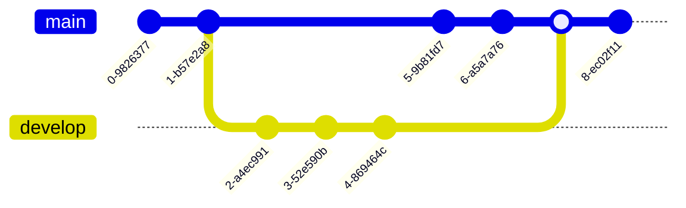

[//]: # (title: Markdown mermaid)

Here are some example mermaid diagrams

## Flowcharts

<tabs>
<tab title="Flow char 1">

</tab>
<tab title="Flow char 2">

</tab>
</tabs>

## Sequence diagram

## Gantt diagram

## Class diagram

## Git graph

## Entity relationship

## Journey diagram

## State diagram

## Pie chart

## Requirements diagram

## C4 System context diagram

## C4 Deployment diagram

## Mind map

<note>
This is still an experimental feature of mermaid. Will be included in the next release
</note>

