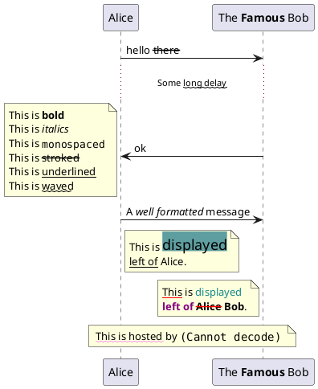
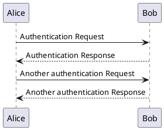
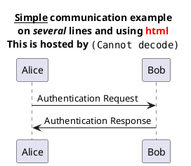

# Starter

## Creole and HTML

You can also define title on several lines using title and end title keywords.

[link](Starter-test.md#標題).

標題

標題

標題

標題

標題

標題
標題標題

標題

標題

標題

## 標題

Paragraph