# Mermaid other types MD

## Add new topics

{ width=290 }{border-effect=line}

## Diagram with own title

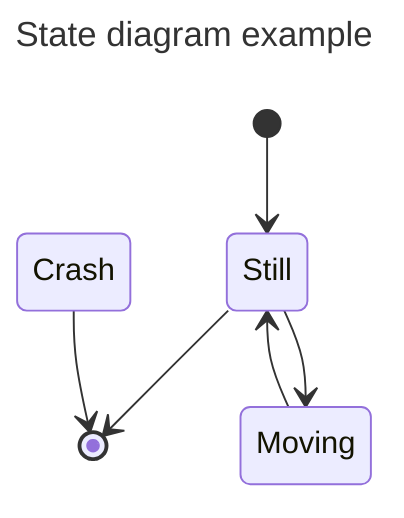

## Cardinality / Multiplicity on relations

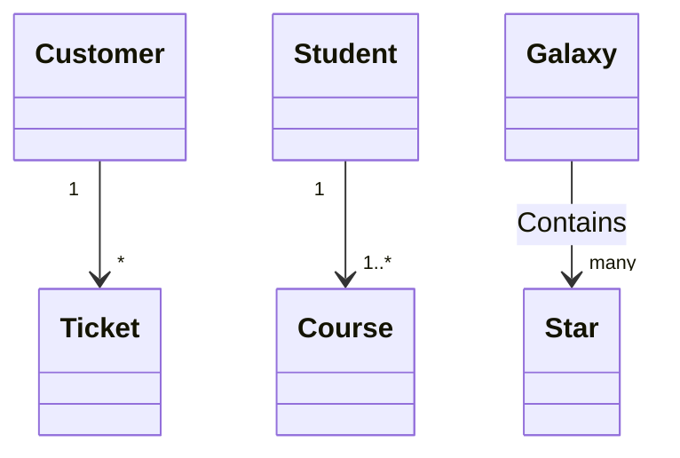

## Annotations on classes

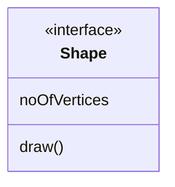

## Nested structure annotations

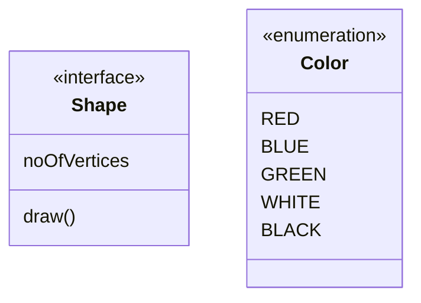

## Comments

Comments can be entered within a class diagram, which will be ignored by the parser. Comments need to be on their own line, and must be prefaced with %% (double percent signs). Any text until the next newline will be treated as a comment, including any class diagram syntax.

## Setting the direction of the diagram

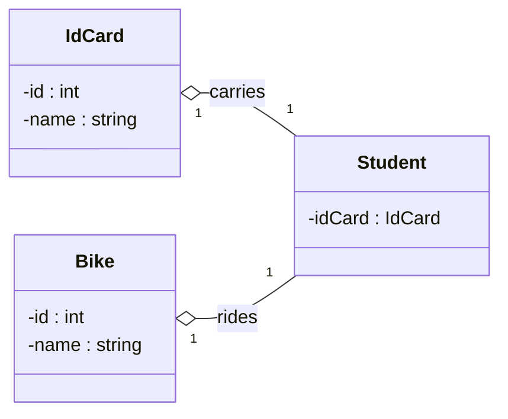

## Notes

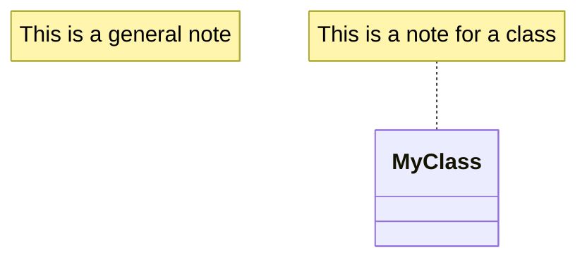

## URL Link

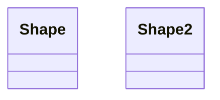

## Class animals

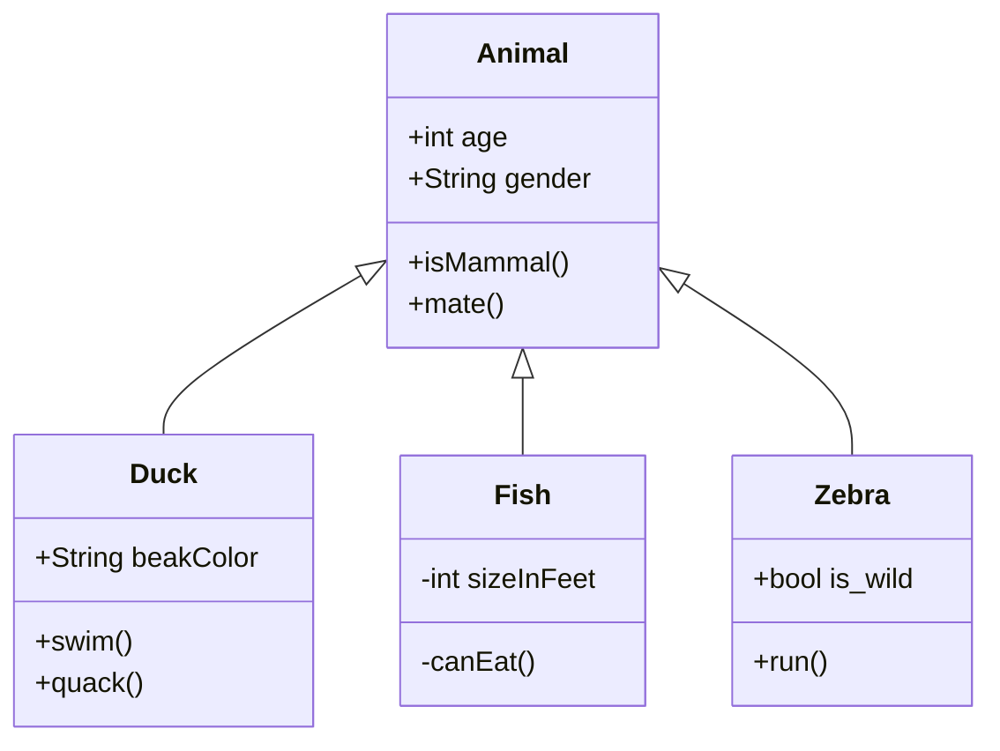

## ClassDiagram with styles

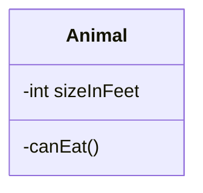

## Defining Relationship

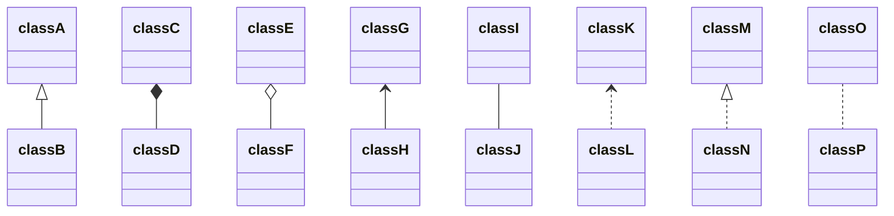

## Labels on Relations

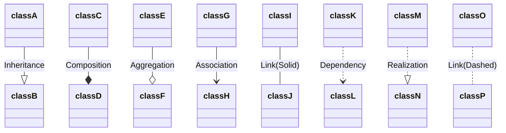

## Two-way relations

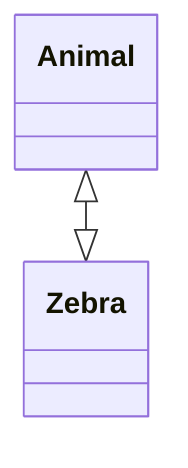