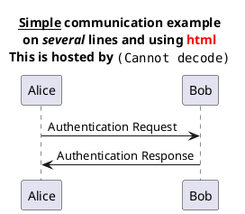
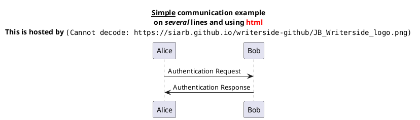

# Starter

```plantuml
@startuml

title
 <u>Simple</u> communication example
 on <i>several</i> lines and using <font color=red>html</font>
 This is hosted by <img:JB_Writerside_logo.png>
end title

Alice -> Bob: Authentication Request
Bob -> Alice: Authentication Response

@enduml
```

```plantuml
@startuml

title
 <u>Simple</u> communication example
 on <i>several</i> lines and using <font color=red>html</font>
 This is hosted by <img:https://siarb.github.io/writerside-github/JB_Writerside_logo.png>
end title

Alice -> Bob: Authentication Request
Bob -> Alice: Authentication Response

@enduml
```