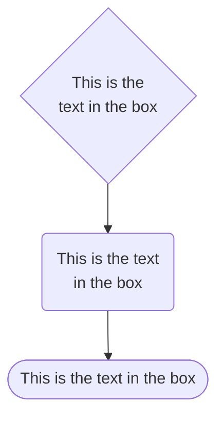
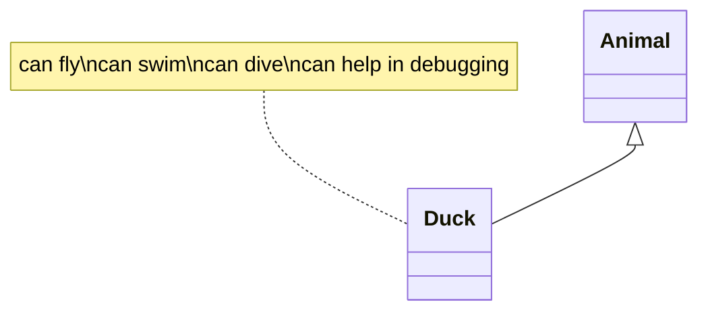
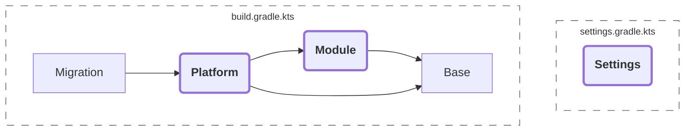

# शुभ प्रभात 😊 :boy:







<no-index/>

```
```
{src="./शुभ-प्रभात.md"}

```
```

{src="./TLDR-MD.md"}

## शुभ प्रभात

<tooltip term="foo">test</tooltip>

<shortcut key="$Copy"></shortcut>

<p>
:santa|type_6:
In der folgenden Übersicht werden alle Gutschein-Kampagnen angezeigt, die in Plentymarkets aktuell angelegt sind.
Diese sind in der Regel nach dem Code (bei Aktionsgutscheinen) oder nach dem Typen benannt. Sollte diese Liste einmal leer sein, liegt das an dem Datumsfilter.
Um alle Gutscheine anzuzeigen, muss lediglich der Reset-Button  und dann der Suchen-Button <icon src="4_5.png" width="24" height="24"/> angeklickt werden.
</p>

शुभ प्रभात

[](#शुभ-परभात-2)

### शुभ प्रभात-2 {id="शुभ-परभात-3"}

:smile: 😊

शुभ प्रभात

## शुभ प्रभात

[](#शुभ-परभात-2)

### शुभ प्रभात-2 {id="शुभ-परभात-2"}

{thumbnail="true"}

{thumbnail="true"}