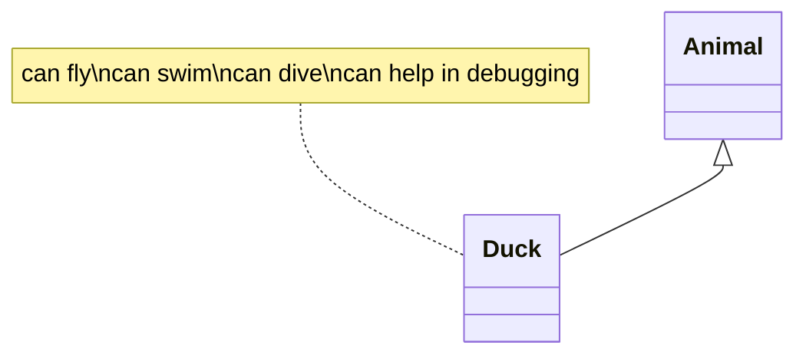
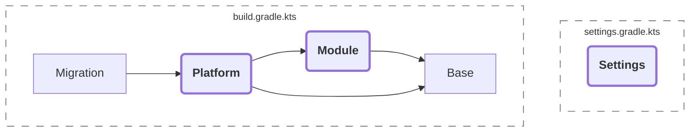

# शुभ प्रभात 😊 :boy:

UPDATED

```mermaid
```

{src="../../seq.mermaid"}

```Kotlin
```

{src="../newTest.kt" id="include-file-symbol-not-empty" collapsed-title-line-number="1" include-lines="4" collapsible="
true"}

```Kotlin
```

{src="$PROJECT_DIR$/Writerside2/newTest.kt" id="include-file" collapsed-title-line-number="1" include-lines="4"
collapsible="true"}

```mermaid
```

{src="$PROJECT_DIR$/seq.mermaid"}

```plantuml
```

{src="$WRS_MODULE$/../seq.puml"}

```Mermaid
graph TD;
    A[初始化] --> B{是否初始化成功?}
    B -->|是| C[准备关机]
    B -->|否| D[清除缓存]
    D --> A
```

<code-block lang="yaml">
services:
    web:
        image: nginx:latest
        ports:
            - "8080:80"
        volumes:
            - ./html:/usr/share/nginx/html
        restart: always
</code-block>

```
program FindGrade(input,output);
    var Marks : integer;
        Grade : char;
begin
    writeln('Enter Marks');
    read(Marks);
    case Marks of
        0..34 : Grade := 'W';
        35..49 : Grade := 'S';
        50..64 : Grade := 'C';
        65..74 : Grade := 'B';
        75..100 : Grade := 'A';
    else
            writeln('Invalid Marks');
    end;
    if (Marks >= 0) AND (Marks <= 100) then
        writeln('Grade is ' , Grade);
end.
```

<procedure title="Configure Nginx to load balance between the two instances.">
<step>Install Nginx
<code-block lang="bash">
sudo apt install nginx
</code-block>
</step>

<step>
Update the file <code>/etc/nginx/nginx.conf</code> to the following
<code-block lang="nginx">
stream {
  server {
    listen 6443;
    proxy_pass stream_master_nodes;
  }

upstream stream_master_nodes {
server IP_of_Node_1:6443;
server IP_of_Node_2:6443;
}
}
</code-block>
</step>
</procedure>

# Setting Up K3S in High Availability

<procedure title="Configure Nginx to load balance between the two instances.">
<step>Install Nginx

```Bash
sudo apt install nginx
```

</step>
<step>
Update the file <code>/etc/nginx/nginx.conf</code> to the following

```NGINX
stream {
  server {
    listen 6443;
    proxy_pass stream_master_nodes;
  }

upstream stream_master_nodes {
    server IP_of_Node_1:6443;
    server IP_of_Node_2:6443;
    }
}
```

</step>
</procedure>

```dart
int fibonacci(int n) {
  if (n == 0 || n == 1) return n;
  return fibonacci(n - 1) + fibonacci(n - 2);
}

var result = fibonacci(20);
``` 

```ASP.NET (VB)
<%-- I break docker build :( --%>
```

```xml

<%-- I build successfully :) --%>
```

```python
import sys

if __name__ == "__main__":
    print("Hello world")
```

<code-block lang="python">
return [
    /*
     * Determines what type of files to use when updating language files.
     *
     * @see https://laravel-lang.com/configuration.html#inline
     *
     * By default, `false`.
     */

    'inline' => (bool) env('LOCALIZATION_INLINE', env('LANG_PUBLISHER_INLINE')),

    /*
     * Do arrays need to be aligned by keys before processing arrays?
     *
     * @see https://laravel-lang.com/configuration.html#alignment
     *
     * By default, true
     */

    'align' => (bool) env('LOCALIZATION_ALIGN', env('LANG_PUBLISHER_ALIGN', true)),

    /*
     * The language codes chosen for the files in this repository may not
     * match the preferences for your project.
     *
     * Specify here mappings of localizations with your project.
     *
     * @see https://laravel-lang.com/configuration.html#aliases
     */

    'aliases' => [
        // \LaravelLang\LocaleList\Locale::German->value => 'de-DE',
        // \LaravelLang\LocaleList\Locale::GermanSwitzerland->value => 'de-CH',
    ],

    /*
     * This option determines the mechanism for converting translation
     * keys into a typographic version.
     *
     * @see https://laravel-lang.com/configuration.html#smart_punctuation
     *
     * By default, false
     */

    'smart_punctuation' => [
        'enable' => (bool) env('LOCALIZATION_SMART_ENABLED', false),

        'common' => [
            'double_quote_opener' => '“',
            'double_quote_closer' => '”',
            'single_quote_opener' => '‘',
            'single_quote_closer' => '’',
        ],

        'locales' => [
            Locale::French->value => [
                'double_quote_opener' => '«&nbsp;',
                'double_quote_closer' => '&nbsp;»',
                'single_quote_opener' => '‘',
                'single_quote_closer' => '’',
            ],

            Locale::Russian->value => [
                'double_quote_opener' => '«',
                'double_quote_closer' => '»',
                'single_quote_opener' => '‘',
                'single_quote_closer' => '’',
            ],

            Locale::Ukrainian->value => [
                'double_quote_opener' => '«',
                'double_quote_closer' => '»',
                'single_quote_opener' => '‘',
                'single_quote_closer' => '’',
            ],

            Locale::Belarusian->value => [
                'double_quote_opener' => '«',
                'double_quote_closer' => '»',
                'single_quote_opener' => '‘',
                'single_quote_closer' => '’',
            ],
        ],
    ],

    /*
     * This option defines the application's route settings.
     *
     * @see https://laravel-lang.com/configuration.html#routes
     */

    'routes' => [
        /*
         * This option defines the settings for the key names used when working with application routing.
         *
         * Default values:
         *
         *   parameter - locale
         *   header    - Accept-Language
         *   cookie    - Accept-Language
         *   session   - Accept-Language
         *   column    - column
         */

        'names' => [
            'parameter' => RouteName::Parameter,
            'header'    => RouteName::Header,
            'cookie'    => RouteName::Cookie,
            'session'   => RouteName::Session,
            'column'    => RouteName::Column,
        ],

        /*
         * This option specifies the prefix of route group names.
         *
         * By default, `localized.`
         */

        'name_prefix' => env('LOCALIZATION_NAME_PREFIX', 'localized.'),

        /*
         * This option specifies the request redirection option when trying to open the default localization.
         *
         * Applies when using the `LaravelLang\Routes\Facades\LocalizationRoute` facade.
         */

        'redirect_default' => (bool) env('LOCALIZATION_REDIRECT_DEFAULT', false),
    ],

    /*
     * This option defines settings for working with model translations.
     *
     * @see https://laravel-lang.com/configuration.html#models
     */

    'models' => [
        /*
         * This option specifies a suffix for models containing translations.
         *
         * For example,
         *   main model is `App\Models\Page`
         *   translation model is `App\Models\PageTranslation`
         *
         * By default, `Translation`
         */

        'suffix' => 'Translation',

        /*
         * This option determines the need to filter localizations loaded
         * in the relay when using eager loading.
         *
         * By default, true.
         */

        'filter' => [
            'enabled' => (bool) env('LOCALIZATION_FILTER_ENABLED', true),
        ],

        /*
         * This option specifies a folder to store helper files for the IDE.
         *
         * By default, `vendor/_laravel_lang`
         */

        'helpers' => env('VENDOR_PATH', base_path('vendor/_laravel_lang')),
    ],

    /*
     * This option contains a list of translators that the Laravel Lang Translator project works with.
     *
     * Google Translate is enabled by default.
     *
     * @see https://laravel-lang.com/configuration.html#translators
     */

    'translators' => [
        /*
         * List of channels used for translations.
         *
         * By default,
         *
         *     Google is enabled
         *     Deepl  is disabled
         *     Yandex is disabled
         */

        'channels' => [
            'google' => [
                'translator' => '\LaravelLang\Translator\Integrations\Google',

                'enabled'  => (bool) env('TRANSLATION_GOOGLE_ENABLED', true),
                'priority' => (int) env('TRANSLATION_GOOGLE_PRIORITY', 1),
            ],

            'deepl' => [
                'translator' => '\LaravelLang\Translator\Integrations\Deepl',

                'enabled'  => (bool) env('TRANSLATION_DEEPL_ENABLED', false),
                'priority' => (int) env('TRANSLATION_DEEPL_PRIORITY', 2),

                'credentials' => [
                    'key' => (string) env('TRANSLATION_DEEPL_KEY'),
                ],
            ],

            'yandex' => [
                'translator' => '\LaravelLang\Translator\Integrations\Yandex',

                'enabled'  => (bool) env('TRANSLATION_YANDEX_ENABLED', false),
                'priority' => (int) env('TRANSLATION_YANDEX_PRIORITY', 3),

                'credentials' => [
                    'key'    => (string) env('TRANSLATION_YANDEX_KEY'),
                    'folder' => (string) env('TRANSLATION_YANDEX_FOLDER_ID'),
                ],
            ],
        ],

        'options' => [
            /*
             * Set a custom pattern for extracting replaceable keywords from the string,
             * default to extracting words prefixed with a colon.
             *
             *  Available options:
             *
             *     `true` is a `/:(\w+)/`
             *     `false` will disable regular expression processing
             *      `/any regex/` - any regular expression you specify
             *
             *   By default, `true`
             *
             * @example (e.g. "Hello :name" will extract "name")
             */

            'preserve_parameters' => true,
        ],
    ],

];
</code-block>






<no-index/>

```
```
{src="./शुभ-प्रभात.md"}

```
```

{src="./TLDR-MD.md"}

## शुभ प्रभात

<tooltip term="foo">test</tooltip>

<shortcut key="$Copy"></shortcut>

<p>
:santa|type_6:
In der folgenden Übersicht werden alle Gutschein-Kampagnen angezeigt, die in Plentymarkets aktuell angelegt sind.
Diese sind in der Regel nach dem Code (bei Aktionsgutscheinen) oder nach dem Typen benannt. Sollte diese Liste einmal leer sein, liegt das an dem Datumsfilter.
Um alle Gutscheine anzuzeigen, muss lediglich der Reset-Button  und dann der Suchen-Button <icon src="4_5.png" width="24" height="24"/> angeklickt werden.
</p>

शुभ प्रभात

[](#शुभ-परभात-2)

### शुभ प्रभात-2 {id="शुभ-परभात-3"}

:smile: 😊

शुभ प्रभात

## शुभ प्रभात

[](#शुभ-परभात-2)

### शुभ प्रभात-2 {id="शुभ-परभात-2"}

{thumbnail="true"}

{thumbnail="true"}

