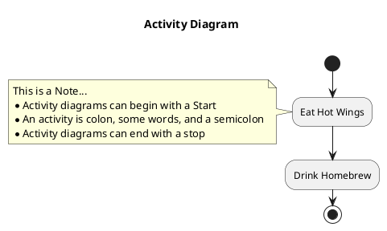
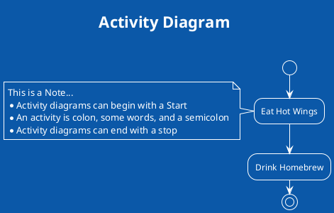
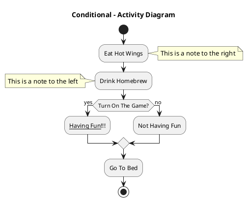
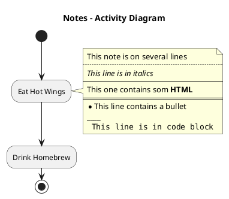
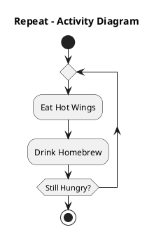
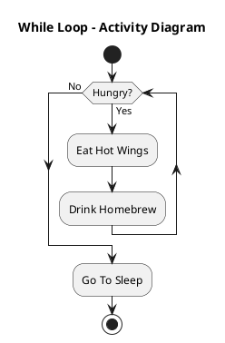
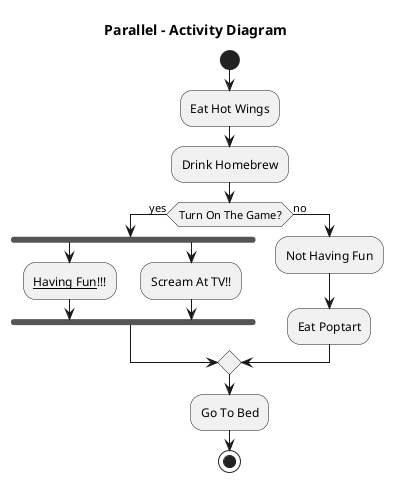
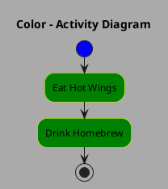

# PlantUML Activity MD

## Activity

### Activity 1

```plantuml
@startuml
title Activity Diagram \n

start

:Eat Hot Wings;

note left
    This is a Note...
    * Activity diagrams can begin with a Start
    * An activity is colon, some words, and a semicolon
    * Activity diagrams can end with a stop
end note

:Drink Homebrew;

stop

@enduml
```

### Activity 2

```plantuml
@startuml
!theme amiga

skin rose

title Activity Diagram \n

start

:Eat Hot Wings;

note left
    This is a Note...
    * Activity diagrams can begin with a Start
    * An activity is colon, some words, and a semicolon
    * Activity diagrams can end with a stop
end note

:Drink Homebrew;

stop

@enduml
```

### Conditional

```plantuml
@startuml
title Conditional - Activity Diagram 


start

:Eat Hot Wings; 
note right: This is a note to the right

:Drink Homebrew; 
note left: This is a note to the left

if (Turn On The Game?) then (yes)
  :__Having Fun__!!!;
else (no)
  :Not Having Fun;
endif

:Go To Bed;

stop

@enduml
```

### Notes

```plantuml
@startuml
title Notes - Activity Diagram 


start

:Eat Hot Wings;

note right
  This note is on several lines
  ....
  //This line is in italics//
  ----
  This one contains som <b>HTML</b>
  ====
  * This line contains a bullet
  ____
  "" This line is in code block""
end note

:Drink Homebrew;

stop

@enduml
```

### Repeat

```plantuml
@startuml
title Repeat - Activity Diagram 


start

repeat
  :Eat Hot Wings;
  :Drink Homebrew;
repeat while (Still Hungry?)

stop

@enduml
```

### While loop

```plantuml
@startuml
title While Loop - Activity Diagram 


start

while (Hungry?)  is (Yes)
  :Eat Hot Wings;
  :Drink Homebrew;
endwhile (No)

:Go To Sleep;

stop

@enduml
```

### Parallel

```plantuml
@startuml
title Parallel - Activity Diagram 


start

:Eat Hot Wings;

:Drink Homebrew;

if (Turn On The Game?) then (yes)
  fork
    :__Having Fun__!!!;
  fork again
    :Scream At TV!!;
  end fork
else (no)
  :Not Having Fun;
  :Eat Poptart;
endif

:Go To Bed;

stop

@enduml
```

### Color

```plantuml
@startuml
title Color - Activity Diagram 


skinparam backgroundColor #AAAAAA
skinparam activity {
  StartColor Blue
  EndColor Red
  BackgroundColor Green
  BorderColor Yellow
}

start

:Eat Hot Wings;

:Drink Homebrew;

stop

@enduml
```
