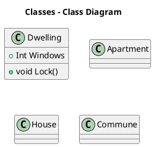
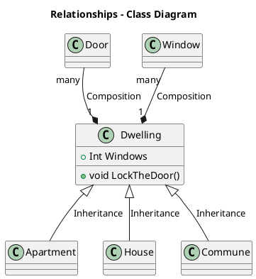
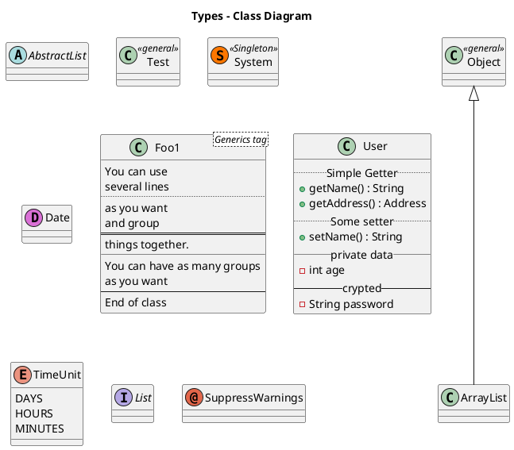
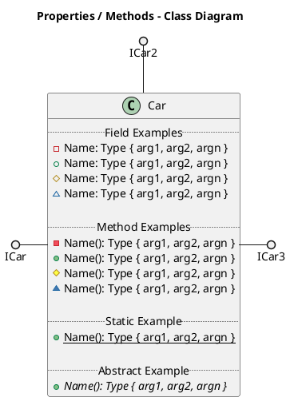
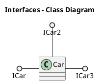
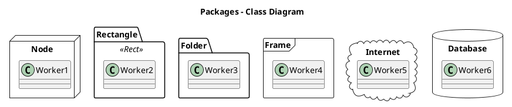

# PlantUML Class MD

## Class

```plantuml
@startuml
title Classes - Class Diagram


class Dwelling {
  +Int Windows
  +void Lock()
}

class Apartment
class House
class Commune

@enduml
```

### Relationship

```plantuml
@startuml
title Relationships - Class Diagram


class Dwelling {
  +Int Windows
  +void LockTheDoor()
}

class Apartment
class House
class Commune
class Window
class Door

Dwelling <|-down- Apartment: Inheritance
Dwelling <|-down- Commune: Inheritance
Dwelling <|-down- House: Inheritance
Dwelling "1" *-up- "many" Window: Composition
Dwelling "1" *-up- "many" Door: Composition

@enduml
```

### Types

```plantuml
@startuml
title Types - Class Diagram


skinparam componentStyle uml2

abstract class AbstractList {

}

class Test << general >> {
}

class System << (S,#FF7700) Singleton >>
class Date << (D,orchid) >>

class Foo1<Generics tag> {
  You can use
  several lines
  ..
  as you want
  and group
  ==
  things together.
  __
  You can have as many groups
  as you want
  --
  End of class
}

class User {
  .. Simple Getter ..
  + getName() : String
  + getAddress() : Address
  .. Some setter ..
  + setName() : String
  __ private data __
  -int age
  -- crypted --
  -String password
}

enum TimeUnit {
  DAYS
  HOURS
  MINUTES
}

interface List {

}

annotation SuppressWarnings

class Object << general >>
Object <|--- ArrayList

@enduml
```

### Properties / methods

```plantuml
@startuml
title Properties / Methods - Class Diagram


skinparam componentStyle uml2
class Car {
  .. Field Examples ..
- Name: Type { arg1, arg2, argn }
+Name: Type { arg1, arg2, argn }
#Name: Type { arg1, arg2, argn }
~Name: Type { arg1, arg2, argn }

  .. Method Examples ..
-Name(): Type { arg1, arg2, argn }
+Name(): Type { arg1, arg2, argn }
#Name(): Type { arg1, arg2, argn }
~Name(): Type { arg1, arg2, argn }

  .. Static Example ..
+{static} Name(): Type { arg1, arg2, argn }

  .. Abstract Example ..
+{abstract} Name(): Type { arg1, arg2, argn }
}

class Car
ICar ()- Car
ICar2 ()-- Car
Car -() ICar3

@enduml
```

### Class interfaces

```plantuml
@startuml

title Interfaces - Class Diagram


class Car
ICar ()- Car
ICar2 ()-- Car
Car -() ICar3

@enduml
```

### Class packages

```plantuml
@startuml
title Packages - Class Diagram


package Node <<Node>> {
  class Worker1
}

package Rectangle <<Rect>> {
  class Worker2
}

package Folder <<Folder>> {
  class Worker3
}

package Frame <<Frame>> {
  class Worker4
}

package Internet <<Cloud>> {
  class Worker5
}

package Database <<Database>> {
  class Worker6
}

@enduml
```
