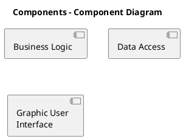
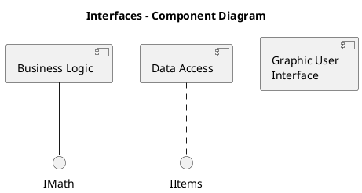
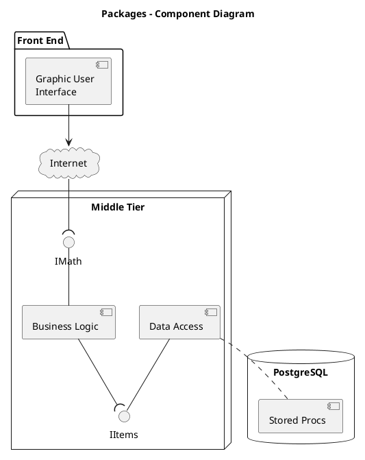
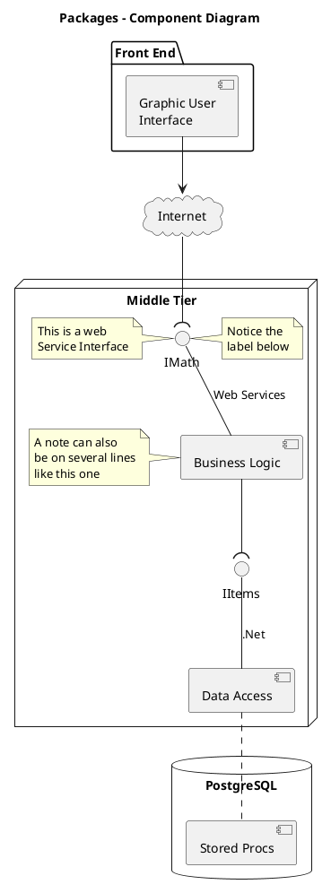

# PlantUML Component MD

## Components

```plantuml
@startuml

title Components - Component Diagram

[Business Logic]
[Data Access] as DA  
component [Graphic User\nInterface] as GUI

@enduml
```

### Component interfaces

```plantuml
@startuml
title Interfaces - Component Diagram

[Business Logic]
[Data Access] as DA  
component [Graphic User\nInterface] as GUI

interface IMath as Math
interface "IItems" as Items

[Business Logic] -- Math
DA .. Items

@enduml
```

### Component packages

```plantuml
@startuml
title Packages - Component Diagram

package "Front End" {
    component [Graphic User\nInterface] as GUI
}

cloud Internet {
}
 
node "Middle Tier" {
    [Business Logic]
    [Data Access] as DA  
    interface IMath as Math
    interface "IItems" as Items
} 

database "PostgreSQL\n" {
    [Stored Procs]
}

GUI -down-> Internet
Internet -down-( Math
[Business Logic] -up- Math
DA -- Items
[Business Logic] --( Items
DA .. [Stored Procs]

@enduml
```

### Labels and notes

```plantuml
@startuml
skinparam componentStyle uml2

title Packages - Component Diagram

package "Front End" {
    component [Graphic User\nInterface] as GUI
}

cloud Internet {
}
 
node "Middle Tier" {
    [Business Logic]
    [Data Access] as DA  
    interface IMath as Math
    note left of Math : This is a web\nService Interface
    note right of Math : Notice the\nlabel below
    interface "IItems" as Items
    
    note left of [Business Logic]
        A note can also
        be on several lines
        like this one
    end note
    
} 

database "PostgreSQL\n" {
    [Stored Procs]
}

GUI -down-> Internet
Internet -down-( Math
[Business Logic] -up- Math : Web Services
DA -up- Items  : .Net
[Business Logic] --( Items
DA .. [Stored Procs]

@enduml
```
