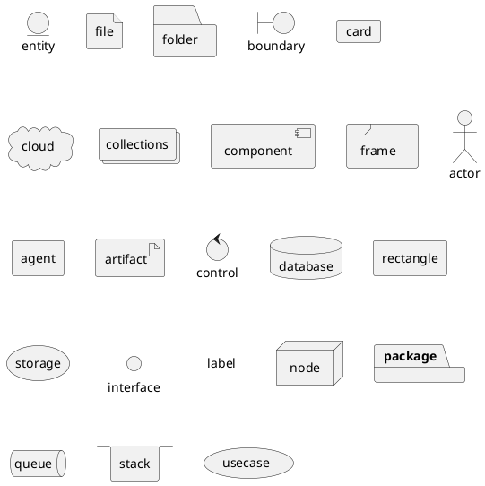
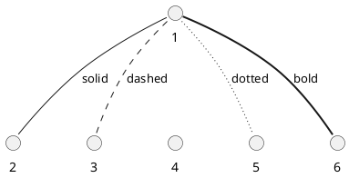
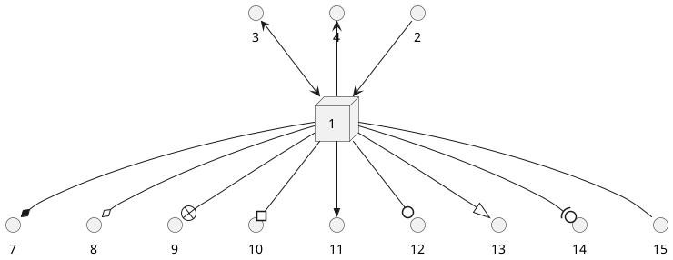
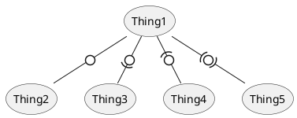
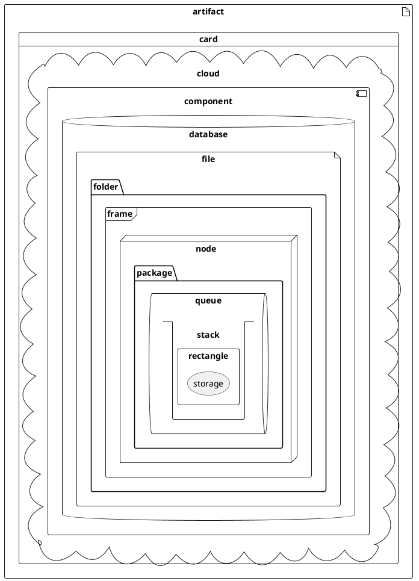
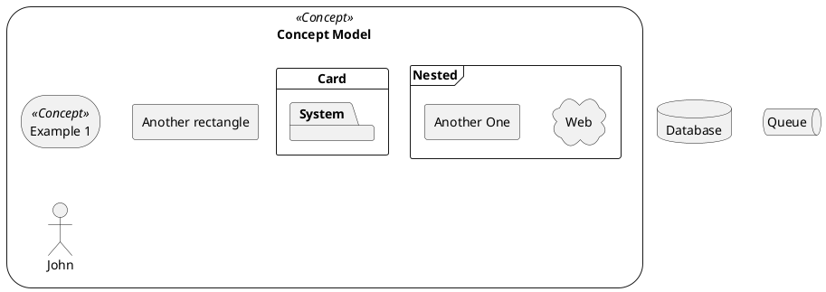

# PlantUML Deployment MD

## Deployment

### All the Elements

```plantuml
@startuml

entity entity
file file
folder folder
boundary boundary
card card
cloud cloud
collections collections
component component
frame frame
actor actor
agent agent
artifact artifact
control control
database database
rectangle rectangle
storage storage
interface interface
label label
node node
package package
queue queue
stack stack
usecase usecase
@enduml
```

### Line types

```plantuml
@startuml
1 -- 2 : solid
1 .. 3 : dashed
1 -[hidden]- 4 : hidden
1 ~~ 5 : dotted
1 == 6 : bold

@enduml
```

### Deployment relationships

```plantuml
@startuml

node 1

1 <-up- 2
1 -up-> 4
1 <-up-> 3

1 --* 7
1 --o 8
1 --+ 9
1 --# 10
1 -->> 11
1 --0 12
1 --^ 13
1 --(0 14
1 -- 15

@enduml
```

### Deployment interfaces

```plantuml
@startuml

storage Thing1
storage Thing2
storage Thing3
storage Thing4
storage Thing5
Thing1 -0- Thing2
Thing1 -0)- Thing3
Thing1 -(0- Thing4
Thing1 -(0)- Thing5

@enduml
```

### Nesting

```plantuml
@startuml

artifact artifact {
 card card {
  cloud cloud {
   component component {
    database database {
     file file {
      folder folder {
       frame frame {
        node node {
         package package {
          queue queue {
           stack stack {
            rectangle rectangle {
             storage storage {
             }
            }
           }
          }
         }
        }
       }
      }
     }
    }
   }
  }
 }
}

@endum
```

### Mixed

```plantuml
@startuml

skinparam rectangle {
    roundCorner<<Concept>> 54
}

rectangle "Concept Model" <<Concept>> {
    rectangle "Example 1" <<Concept>> as ex1
    rectangle "Another rectangle"
    actor John
    frame Nested {
        cloud Web
        rectangle "Another One"
    }
    card Card {
     package System
    }
}
database Database
queue Queue

@enduml
```
