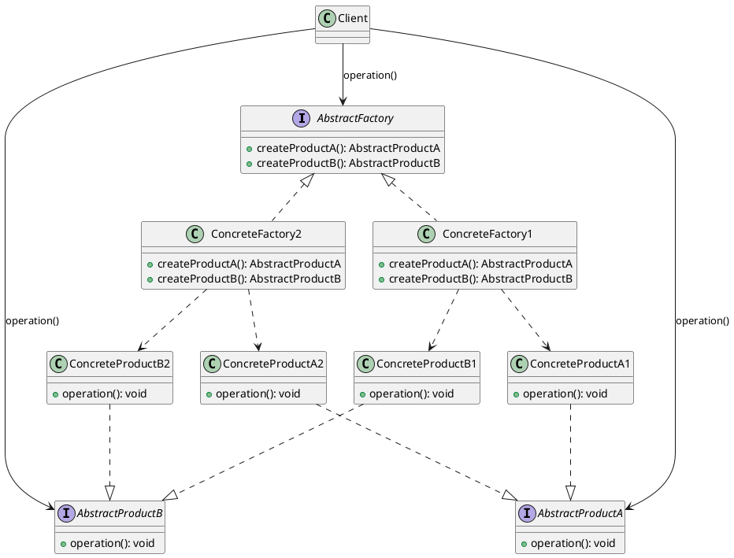
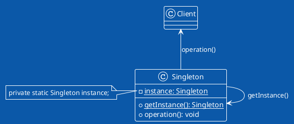
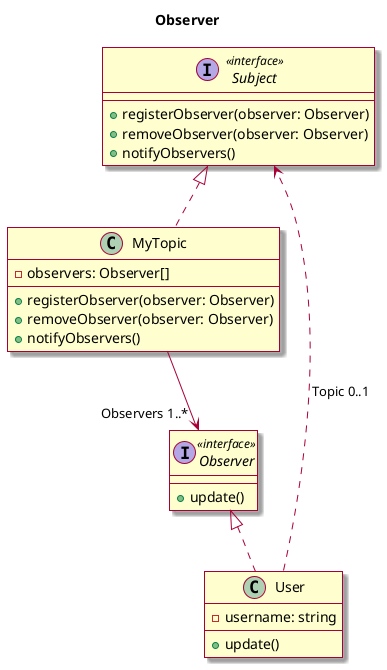

# PlantUML Design Patterns MD

## Design patterns

## Abstract factory

```plantuml
@startuml

interface AbstractFactory {
    +createProductA(): AbstractProductA
    +createProductB(): AbstractProductB
}

class ConcreteFactory1 {
    +createProductA(): AbstractProductA
    +createProductB(): AbstractProductB
}

class ConcreteFactory2 {
    +createProductA(): AbstractProductA
    +createProductB(): AbstractProductB
}

interface AbstractProductA {
    +operation(): void
}

interface AbstractProductB {
    +operation(): void
}


class ConcreteProductA1 {
    +operation(): void
}

class ConcreteProductB1 {
    +operation(): void
}

class ConcreteProductA2 {
    +operation(): void
}

class ConcreteProductB2 {
    +operation(): void
}

AbstractFactory <|.. ConcreteFactory1
AbstractFactory <|.. ConcreteFactory2
AbstractProductA <|..up- ConcreteProductA1
AbstractProductB <|..up- ConcreteProductB1
AbstractProductA <|..up- ConcreteProductA2
AbstractProductB <|..up- ConcreteProductB2
ConcreteFactory1 ..> ConcreteProductA1
ConcreteFactory1 ..> ConcreteProductB1
ConcreteFactory2 ..> ConcreteProductA2
ConcreteFactory2 ..> ConcreteProductB2

AbstractFactory <-up- "Client" : operation()
AbstractProductA <-up- "Client" : operation()
AbstractProductB <-up- "Client" : operation()

@enduml
```

### Singleton theme Amiga

```plantuml
@startuml
!theme amiga

class Singleton {
    -{static} instance: Singleton
    +{static} getInstance(): Singleton
    +operation(): void
}

Singleton -> Singleton : getInstance()
Singleton -up-> "Client" : operation()
note left of Singleton::instance
    private static Singleton instance;
end note

@enduml
```

### Observer skin rose

```plantuml
@startuml

skin rose

title Observer

interface Subject <<interface>> {
    + registerObserver(observer: Observer)
    + removeObserver(observer: Observer)
    + notifyObservers()
}

interface Observer <<interface>> {
    + update()
}

class MyTopic implements Subject {
    - observers: Observer[]
    + registerObserver(observer: Observer)
    + removeObserver(observer: Observer)
    + notifyObservers()
}

class User implements Observer {
    - username: string
    + update()
}

MyTopic --> "Observers 1..*" Observer
User ..> Subject : "Topic 0..1"

@enduml
```
