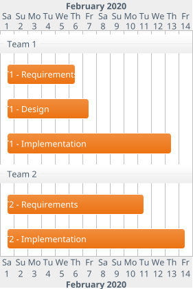
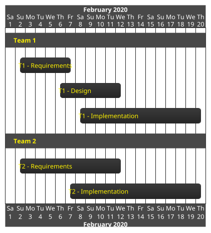
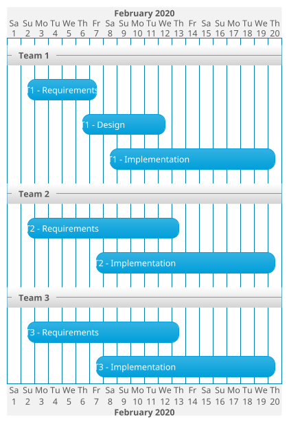
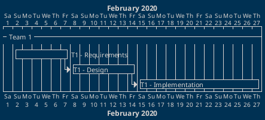
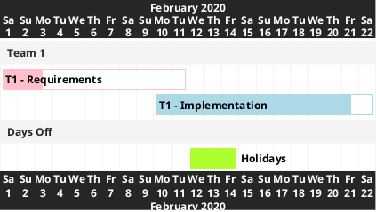
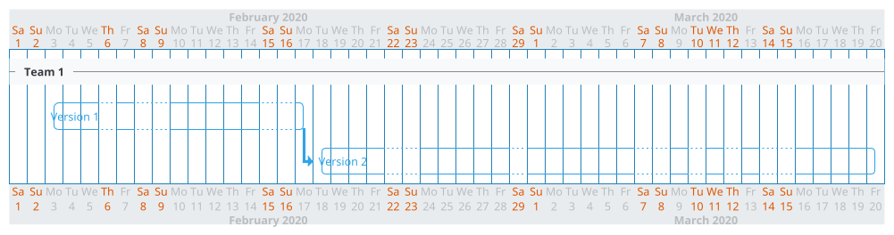
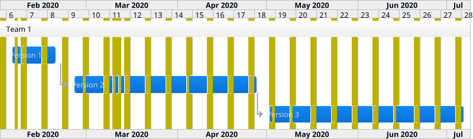
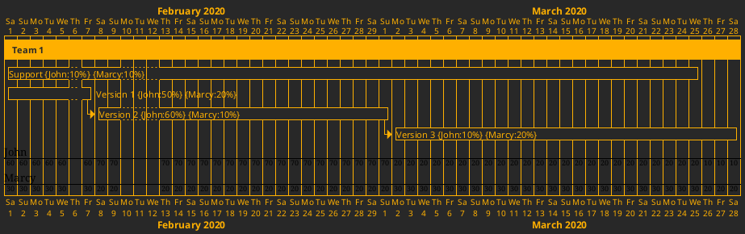
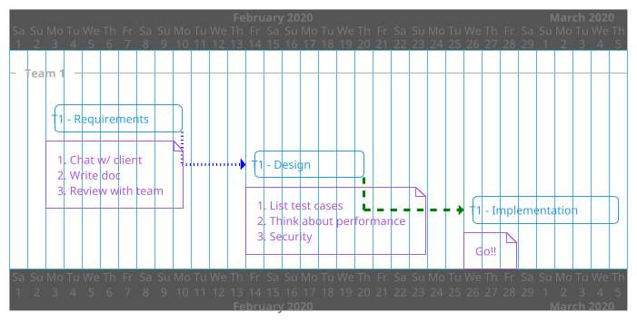

# PlantUML Gantt MD

## Gantt

### Lasts theme `AWS orange`



### Starts theme `Black Knight`



### Starts and Ends theme `Blue Gray`



### Constraints and Short names theme `Blue rint`



### Colors and Completed theme `Carbon Gray`



### Then, Milestones, and Hyperlinks theme `Cerulean`

```plantuml
@startgantt
!theme cerulean

Project starts 2020-02-01

-- Team 1 --
[T1 - Requirements] as [T1R] lasts 6 days
then [T1 - Design] as [T1D] lasts 7 days

'Maps work when you use html map link type
[T1R] links to [[http://www.google.com]]
[T1D] links to [[http://www.yahoo.com]]

'Milestones
[Party for Team] as [PFT] happens at [T1 - Design]'s end
[PFT] is colored in Red

@endgantt
```

### Daily and Closed days theme `Crulean Outline`



### Weekly theme `Cloudscape Design`



### Resource usage theme `CRT Amber`



### Notes theme `Cyborg`

```plantuml
@startgantt
!theme cyborg

Project starts 2020-02-01

-- Team 1 --
[T1 - Requirements] as [T1R] lasts 8 days
note bottom
1. Chat w/ client
2. Write doc
3. Review with team
end note
[T1R] ends 2020-02-10

[T1 - Design] lasts 7 days
note bottom
1. List test cases
2. Think about performance
3. Security
end note


'Adding constraint
[T1 - Design] starts at [T1 - Requirements]'s end

'Short Name
[T1 - Implementation] as [I] lasts 13 days
[I] starts at [T1 - Design]'s end
note bottom
Go!!
end note

@endgantt
```

### Links & Colors theme `Cyborg Outline`


