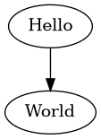
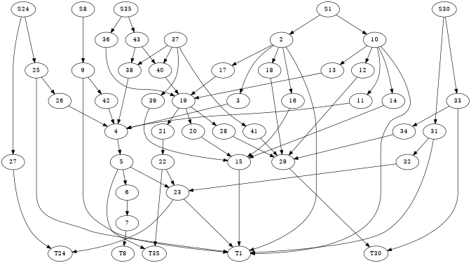
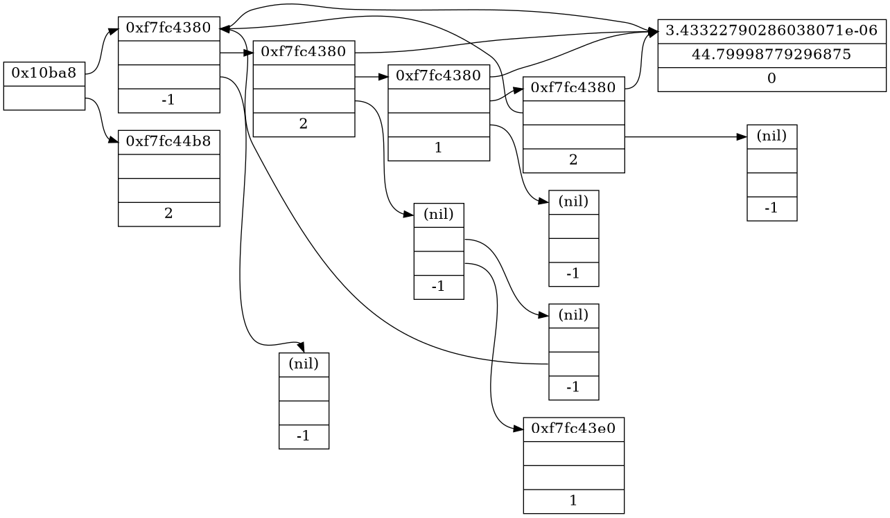

# PlantUML GraphViz MD

## GraphViz

### Hello world

```plantuml
@startuml

digraph G {
    Hello -> World
} 
@enduml
```

### World Dynamics

```plantuml
@startuml

digraph world {
size="7,7";
	{rank=same; S8 S24 S1 S35 S30;}
	{rank=same; T8 T24 T1 T35 T30;}
	{rank=same; 43 37 36 10 2;}
	{rank=same; 25 9 38 40 13 17 12 18;}
	{rank=same; 26 42 11 3 33 19 39 14 16;}
	{rank=same; 4 31 34 21 41 28 20;}
	{rank=same; 27 5 22 32 29 15;}
	{rank=same; 6 23;}
	{rank=same; 7;}

	S8 -> 9;
	S24 -> 25;
	S24 -> 27;
	S1 -> 2;
	S1 -> 10;
	S35 -> 43;
	S35 -> 36;
	S30 -> 31;
	S30 -> 33;
	9 -> 42;
	9 -> T1;
	25 -> T1;
	25 -> 26;
	27 -> T24;
	2 -> {3 ; 16 ; 17 ; T1 ; 18}
	10 -> { 11 ; 14 ; T1 ; 13; 12;}
	31 -> T1;
	31 -> 32;
	33 -> T30;
	33 -> 34;
	42 -> 4;
	26 -> 4;
	3 -> 4;
	16 -> 15;
	17 -> 19;
	18 -> 29;
	11 -> 4;
	14 -> 15;
	37 -> {39 ; 41 ; 38 ; 40;}
	13 -> 19;
	12 -> 29;
	43 -> 38;
	43 -> 40;
	36 -> 19;
	32 -> 23;
	34 -> 29;
	39 -> 15;
	41 -> 29;
	38 -> 4;
	40 -> 19;
	4 -> 5;
	19 -> {21 ; 20 ; 28;}
	5 -> {6 ; T35 ; 23;}
	21 -> 22;
	20 -> 15;
	28 -> 29;
	6 -> 7;
	15 -> T1;
	22 -> T35;
	22 -> 23;
	29 -> T30;
	7 -> T8;
	23 -> T24;
	23 -> T1;
}
@enduml
```

### Data Structures

```plantuml
@startuml
digraph g {
graph [
rankdir = "LR"
];
node [
fontsize = "16"
shape = "ellipse"
];
edge [
];
"node0" [
label = "<f0> 0x10ba8| <f1>"
shape = "record"
];
"node1" [
label = "<f0> 0xf7fc4380| <f1> | <f2> |-1"
shape = "record"
];
"node2" [
label = "<f0> 0xf7fc44b8| | |2"
shape = "record"
];
"node3" [
label = "<f0> 3.43322790286038071e-06|44.79998779296875|0"
shape = "record"
];
"node4" [
label = "<f0> 0xf7fc4380| <f1> | <f2> |2"
shape = "record"
];
"node5" [
label = "<f0> (nil)| | |-1"
shape = "record"
];
"node6" [
label = "<f0> 0xf7fc4380| <f1> | <f2> |1"
shape = "record"
];
"node7" [
label = "<f0> 0xf7fc4380| <f1> | <f2> |2"
shape = "record"
];
"node8" [
label = "<f0> (nil)| | |-1"
shape = "record"
];
"node9" [
label = "<f0> (nil)| | |-1"
shape = "record"
];
"node10" [
label = "<f0> (nil)| <f1> | <f2> |-1"
shape = "record"
];
"node11" [
label = "<f0> (nil)| <f1> | <f2> |-1"
shape = "record"
];
"node12" [
label = "<f0> 0xf7fc43e0| | |1"
shape = "record"
];
"node0":f0 -> "node1":f0 [
id = 0
];
"node0":f1 -> "node2":f0 [
id = 1
];
"node1":f0 -> "node3":f0 [
id = 2
];
"node1":f1 -> "node4":f0 [
id = 3
];
"node1":f2 -> "node5":f0 [
id = 4
];
"node4":f0 -> "node3":f0 [
id = 5
];
"node4":f1 -> "node6":f0 [
id = 6
];
"node4":f2 -> "node10":f0 [
id = 7
];
"node6":f0 -> "node3":f0 [
id = 8
];
"node6":f1 -> "node7":f0 [
id = 9
];
"node6":f2 -> "node9":f0 [
id = 10
];
"node7":f0 -> "node3":f0 [
id = 11
];
"node7":f1 -> "node1":f0 [
id = 12
];
"node7":f2 -> "node8":f0 [
id = 13
];
"node10":f1 -> "node11":f0 [
id = 14
];
"node10":f2 -> "node12":f0 [
id = 15
];
"node11":f2 -> "node1":f0 [
id = 16
];
}
@enduml
```

### Graph Cluster Node Gradient

```plantuml
@startuml
digraph G {
bgcolor="purple:pink" label="agraph" fontcolor="white"
  subgraph cluster1 {fillcolor="blue:cyan" label="acluster" fontcolor="white" style="filled" gradientangle="270"
		node [shape=box fillcolor="red:yellow" style="filled" gradientangle=90]
		anode;
	}

} 
@enduml
```
