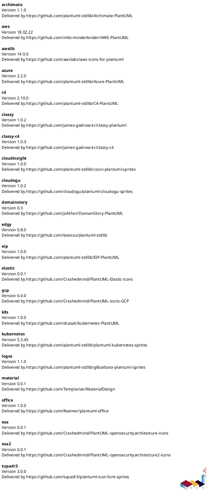
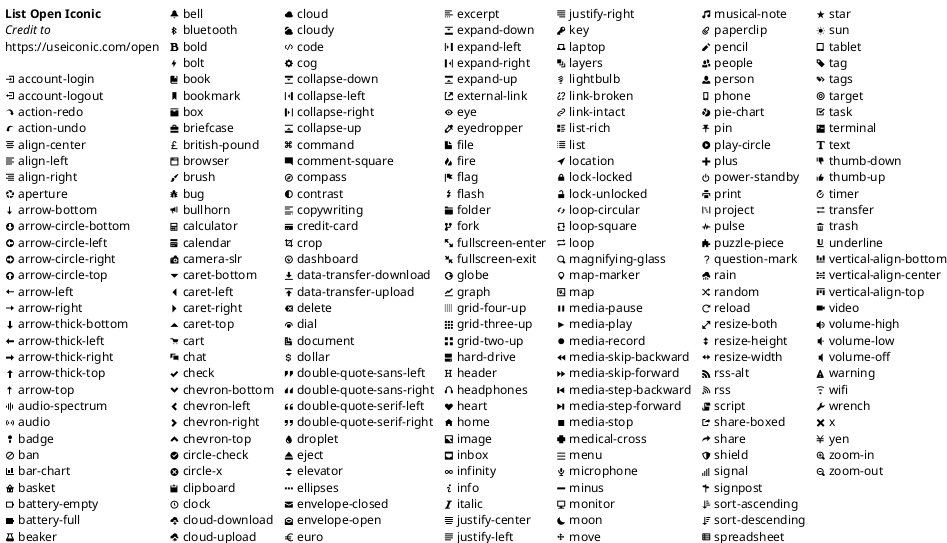
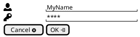
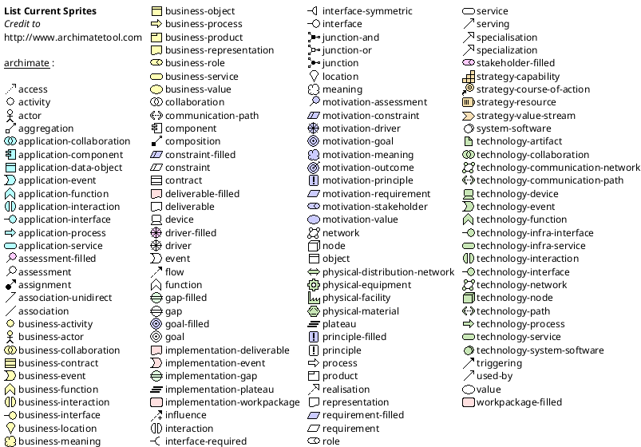

# PlantUML Icons MD

## Icons

### Default library



### List Open Iconic



### Open Iconic Example



### List Archimate Sprites



### Hitchhiker's Guide

```plantuml
@startuml

!define osaPuml https://raw.githubusercontent.com/Crashedmind/PlantUML-opensecurityarchitecture2-icons/master
!include osaPuml/Common.puml
!include osaPuml/User/all.puml
!include osaPuml/Hardware/all.puml
!include osaPuml/Misc/all.puml
!include osaPuml/Server/all.puml
!include osaPuml/Site/all.puml

listsprites

footer %filename() rendered with PlantUML version %version()\nThe Hitchhiker’s Guide to PlantUML


@enduml
```

### Hitchhiker's Guide Example

```plantuml
@startuml

!define osaPuml https://raw.githubusercontent.com/Crashedmind/PlantUML-opensecurityarchitecture2-icons/master
!include osaPuml/Common.puml
!include osaPuml/User/all.puml
!include osaPuml/Hardware/all.puml
!include osaPuml/Misc/all.puml
!include osaPuml/Server/all.puml
!include osaPuml/Site/all.puml

' Users
osa_user_green_developer: <$osa_user_green_developer>
osa_user_green_operations: <$osa_user_green_operations>
osa_user_green_business_manager: <$osa_user_green_business_manager>

' Devices
osa_desktop: <$osa_desktop>
osa_laptop: <$osa_laptop>
osa_iPhone: <$osa_iPhone>
osa_server: <$osa_server>

' Network
osa_device_wireless_router: <$osa_device_wireless_router>
osa_hub: <$osa_hub>
osa_firewall: <$osa_firewall>
osa_osa_cloud: <$osa_cloud>

footer %filename() rendered with PlantUML version %version()\nThe Hitchhiker’s Guide to PlantUML

@enduml
```
