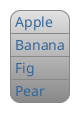
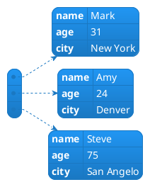
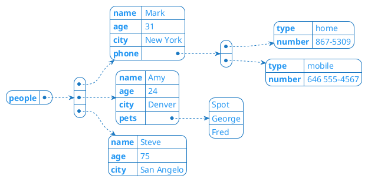
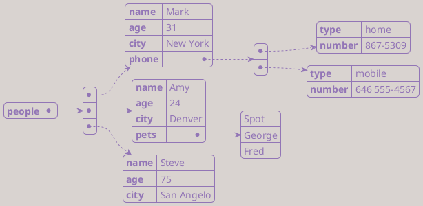
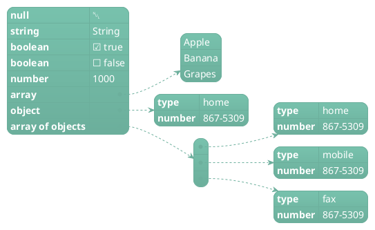
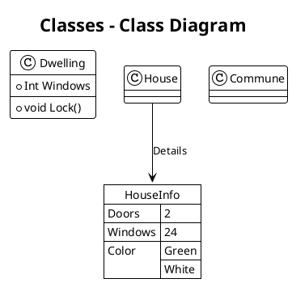

# PlantUML JSON MD

## Object theme Hacker

## Array theme Lightgray

## Array of Objects theme Materia

## Complex theme `Materia Outline`

## Highlighting theme Mimeograph

### Data Types theme Minty

## In other Diagrams theme Plain

