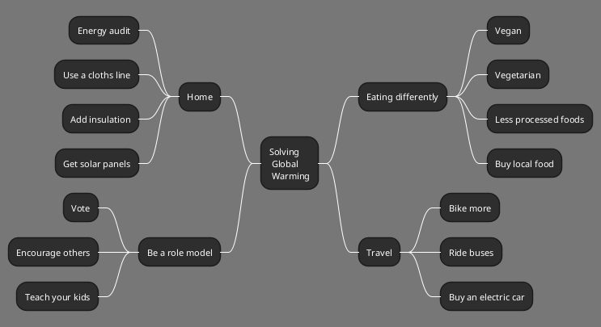
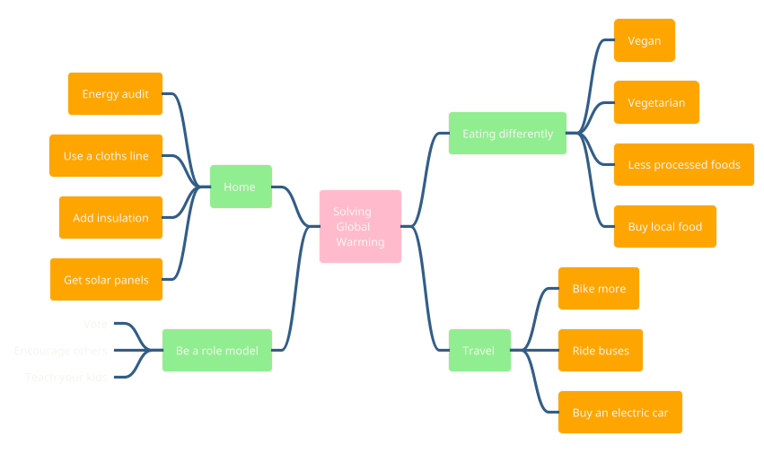
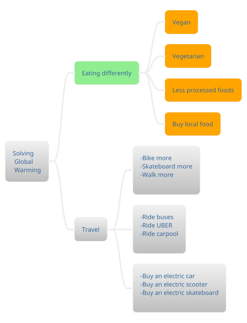
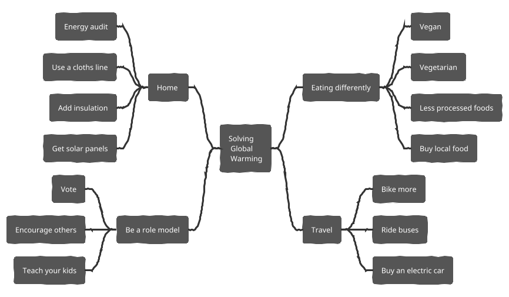
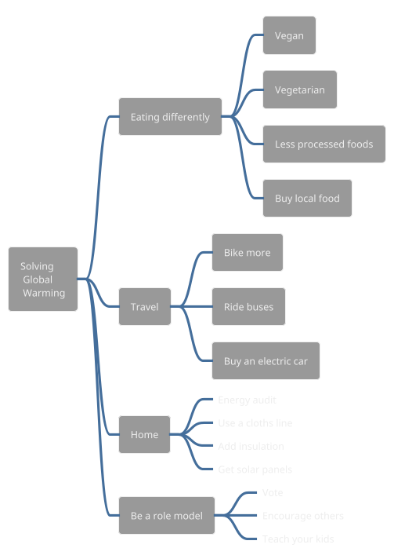
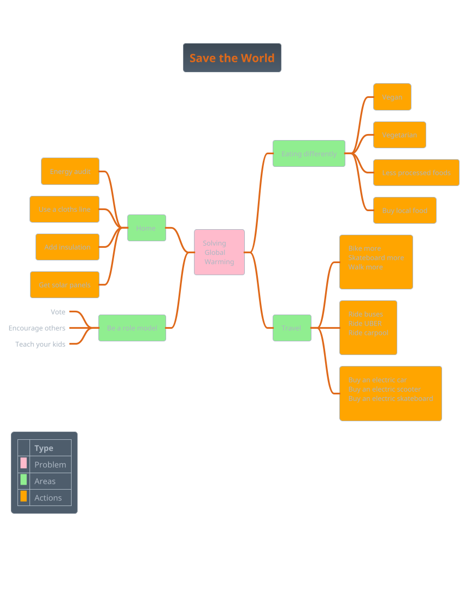
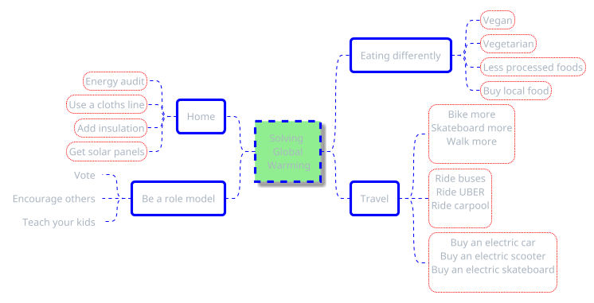

# PlantUML MindMap MD

## Basic theme `Reddress Darkblue`

## Colors & Remove Box theme Sandstone

## Multilines theme Silver

## Arithmetic Notation theme `Sketchy`

## Markdown Syntax theme Spacelab

## Extras theme Superhero

## Styles theme `Superhero Outline`

