# PlantUML Muscallaneous MD

## Oregon Trial

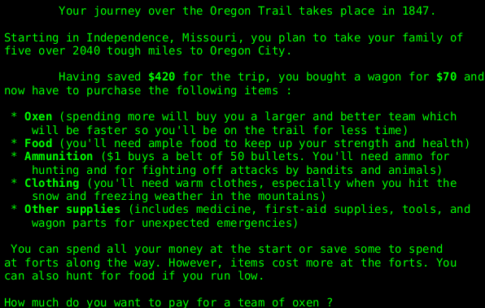

## Handwritten diagram theme Toy

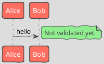

## Steve Jobs

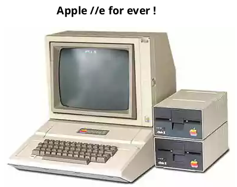

## Smetana project theme United

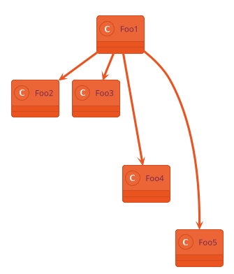

## Colors

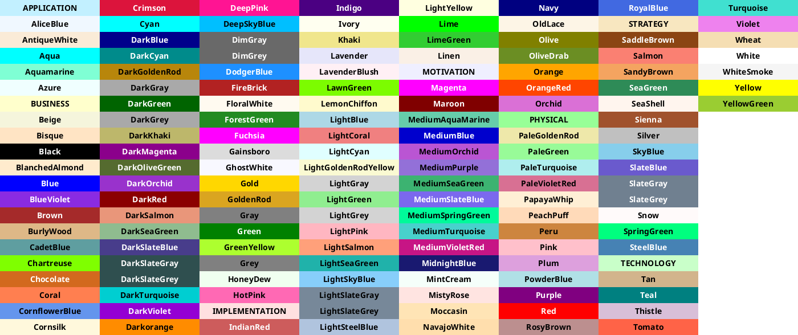

## Colors close to

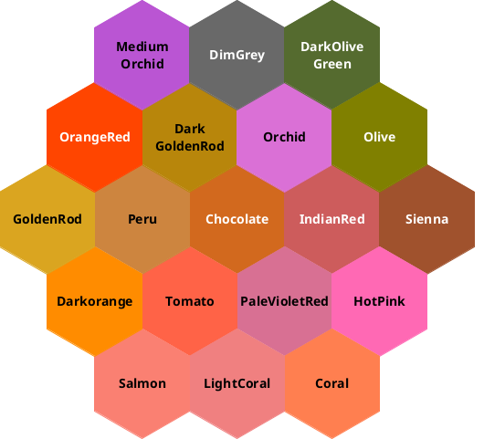

## Write code skin Rose

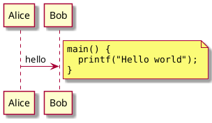

## Legacy html

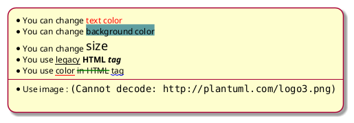

## Escape character skin Rose

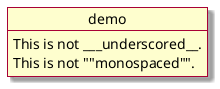

## Emphasized text

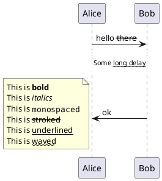

## Lists skin Rose

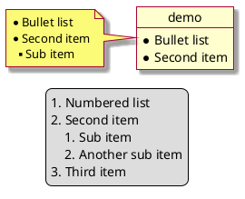