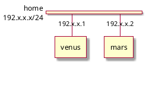
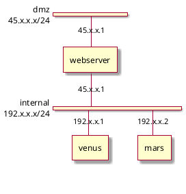
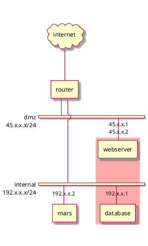
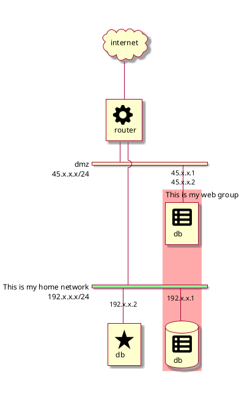
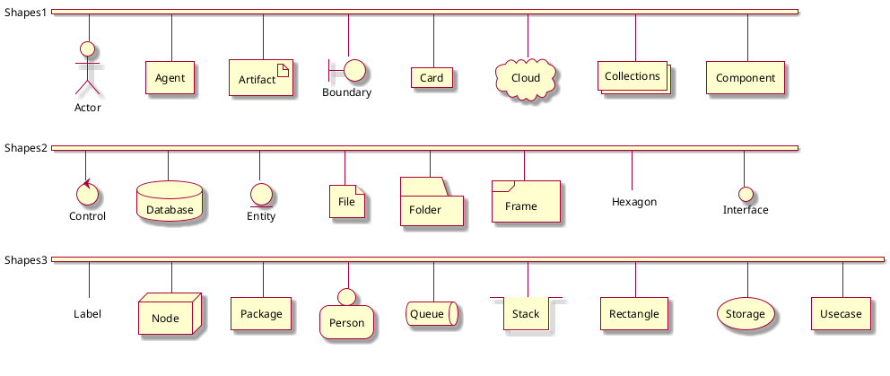

# PlantUML Network MD

## Basic network

```plantuml
@startuml

skin rose

nwdiag {
  network home {
      address = "192.x.x.x/24"

      venus [address = "192.x.x.1"];
      mars [address = "192.x.x.2"];
  }
}
@enduml
```

## Two levels

```plantuml
@startuml

skin rose

nwdiag {
  network dmz {
      address = "45.x.x.x/24"

      webserver [address = "45.x.x.1"];

  }
  network internal {
      address = "192.x.x.x/24"
      
      webserver [address = "45.x.x.1"];

      venus [address = "192.x.x.1"];
      mars [address = "192.x.x.2"];
  }
}
@enduml
```

## Grouping & Color

```plantuml
@startuml

skin rose

nwdiag {
    
    internet [ shape = cloud];
    internet -- router;
    
    group {
        color = "#FFAAAA";
        
        webserver;
        database;
    }
    
    network dmz {
        address = "45.x.x.x/24"
        router
        webserver [address = "45.x.x.1, 45.x.x.2"];
    
    }
    network internal {
        address = "192.x.x.x/24"
        router
        database [address = "192.x.x.1"];
        mars [address = "192.x.x.2"];
    }
}
@enduml
```

## Description & Icons

```plantuml
@startuml

skin rose

nwdiag {
    
    internet [ shape = cloud];
    internet -- router;
    
    group {
        description = "This is my web group"
        color = "#FFAAAA";
        webserver;
        database;
    }
    
    network dmz {
        address = "45.x.x.x/24"
        router
        webserver [address = "45.x.x.1, 45.x.x.2", description = "<&spreadsheet*4>\n db"];
    
    }
    network internal {
        description = "This is my home network"
        color = "palegreen"
        address = "192.x.x.x/24"
        router [description = "<&cog*4>\n router"]
        database [address = "192.x.x.1", description = "<&spreadsheet*4>\n db", shape = database];
        mars [address = "192.x.x.2", description = "<&star*4>\n db"];
    }
}
@endum
```

## Network Objects

```plantuml
@startuml

skin rose

nwdiag {
  network Shapes1 {
    Actor       [shape = actor]       
    Agent       [shape = agent]       
    Artifact    [shape = artifact]    
    Boundary    [shape = boundary]    
    Card        [shape = card]        
    Cloud       [shape = cloud]       
    Collections [shape = collections] 
    Component   [shape = component]   
  }
    network Shapes2 {
    Control     [shape = control]     
    Database    [shape = database]    
    Entity      [shape = entity]      
    File        [shape = file]        
    Folder      [shape = folder]      
    Frame       [shape = frame]       
    Hexagon     [shape = hexagon]     
    Interface   [shape = interface]   
  }
  network Shapes3 {
    Label       [shape = label]       
    Node        [shape = node]        
    Package     [shape = package]     
    Person      [shape = person]      
    Queue       [shape = queue]       
    Stack       [shape = stack]       
    Rectangle   [shape = rectangle]   
    Storage     [shape = storage]     
    Usecase     [shape = usecase]     
  }
}
@enduml
```