# PlantUML Object MD

## Properties

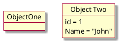

## Relationship

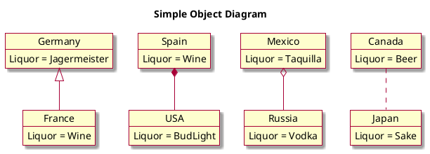

## Nesting approach

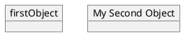

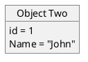

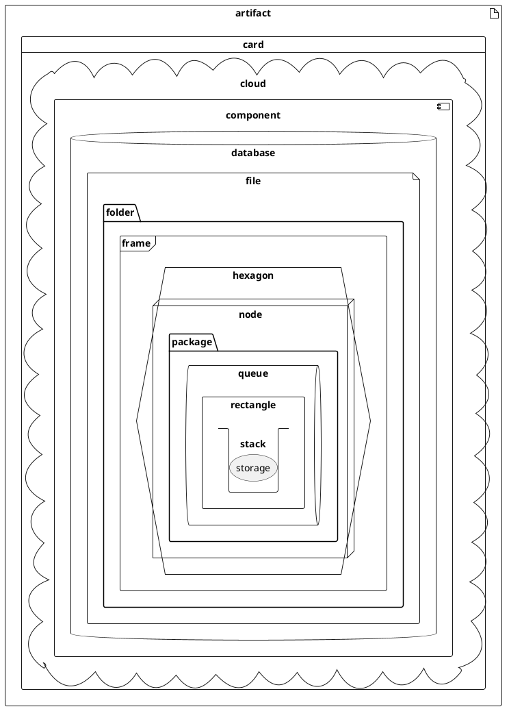

## Nesting reverse alphabetical order

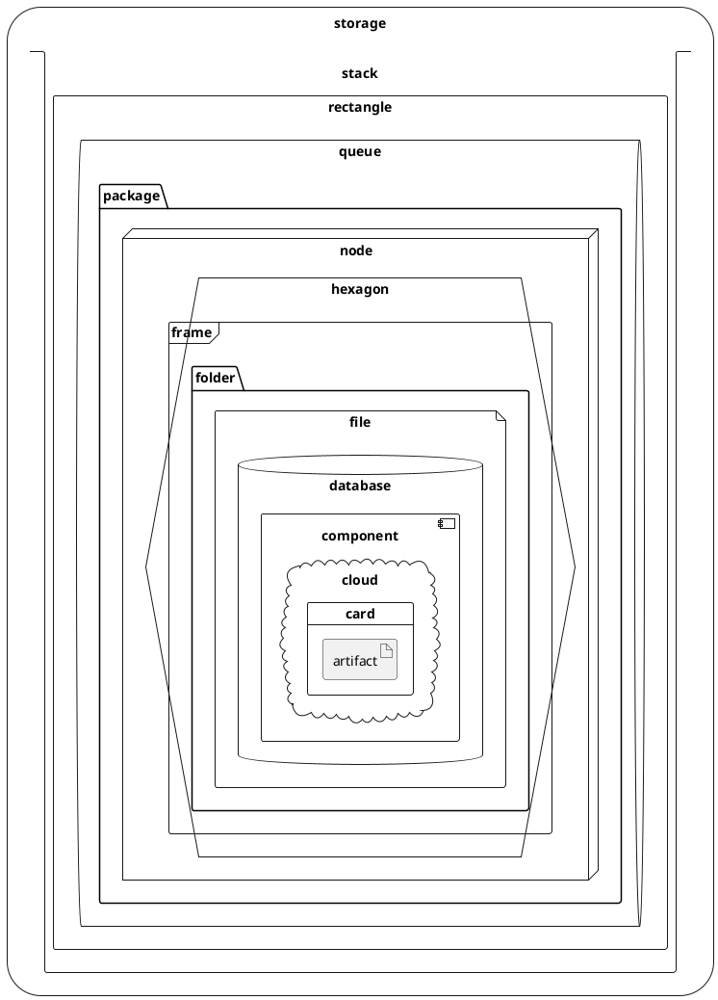

## Associations objects

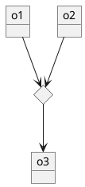

## Adding fields

To declare fields, you can use the symbol `:` followed by the field's name.

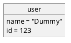

It is also possible to group all fields between brackets `{}`.

## Map table or associative array

### 1

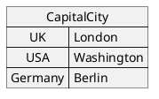

### 2

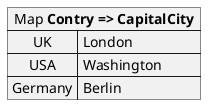

### 3

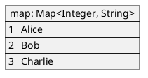

### 4

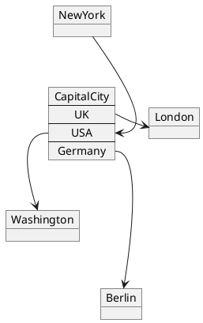

### 5

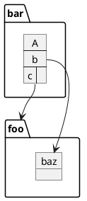

### 6

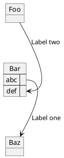

## Program (or project) evaluation and review technique (PERT) with map

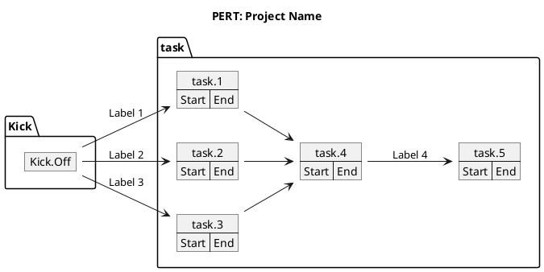