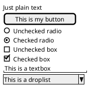
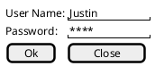
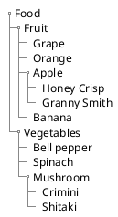
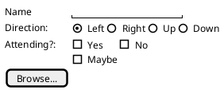
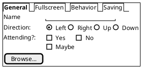
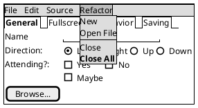
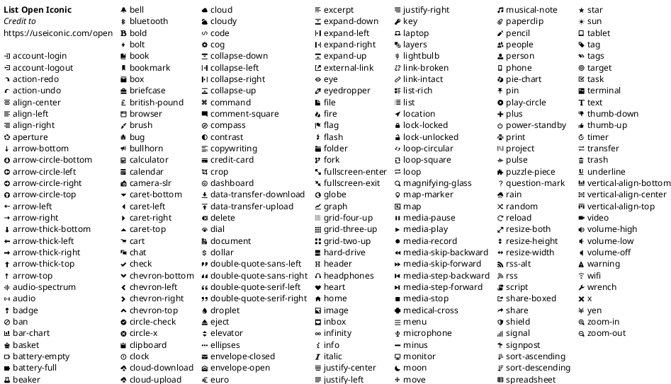

# PlantUML Salt GUI MD

## Basic elements

```plantuml
@startuml

salt
{
  Just plain text
  [This is my button]
  ()  Unchecked radio
  (X) Checked radio
  []  Unchecked box
  [X] Checked box
  "This is a textbox   "
  ^This is a droplist^
}

@enduml
```

## Grid

```plantuml
@startsalt

{
  User Name:| "Justin     "
  Password: | "****       "
  [Ok    ]  | [  Close   ]
}

@endsalt
```

## Separator

```plantuml
@startsalt

{
  This is a dotted line
  ..
  This is a double line
  ==
  This is a thick solid line
  ~~
  This is a thin solid line
  --
}

@endsalt
```

## Tree view

```plantuml
@startsalt

{
    {T
     + Food
     ++ Fruit
     +++ Grape
     +++ Orange
     +++ Apple
     ++++ Honey Crisp
     ++++ Granny Smith
     +++ Banana
     ++ Vegetables
     +++ Bell pepper
     +++ Spinach
     +++ Mushroom
     ++++ Crimini
     ++++ Shitaki
    }
}

@endsalt
```

## Brackets

```plantuml
@startsalt

{
Name         | "                 "
Direction:   | { (X) Left | () Right | () Up | () Down }
Attending?:  | {  [] Yes | [] No  
                  [] Maybe }
 [Browse...] }
}

@endsalt
```

## Tabs

```plantuml
@startsalt

{+

    {/ <b>General | Fullscreen | Behavior | Saving }

    {
    Name         | "                 "
    Direction:   | { (X) Left | () Right | () Up | () Down }
    Attending?:  | {  [] Yes | [] No  
                      [] Maybe }
     [Browse...] }
    }

}

@endsalt
```

## Menus

```plantuml
@startsalt

{+

{* File | Edit | Source | Refactor 
 Refactor | New | Open File | - | Close | <b>Close All</b> }

    {/ <b>General | Fullscreen | Behavior | Saving }

    {
    Name         | "                 "
    Direction:   | { (X) Left | () Right | () Up | () Down }
    Attending?:  | {  [] Yes | [] No  
                      [] Maybe }
     [Browse...] }
    }

}

@endsalt
```

## Iconic symbols

```plantuml
@startuml
listopeniconic
@enduml
```

## Iconic example usage

```plantuml
@startsalt

{
  <&person> Login    | "MyName   "
  <&key> Password | "****     "
  [OK <&account-login>] | [Cancel <&circle-x>]
}

@endsalt
```