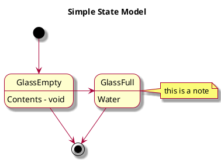
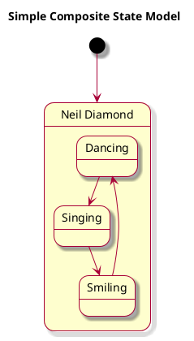
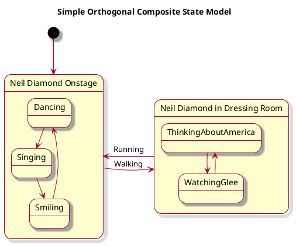
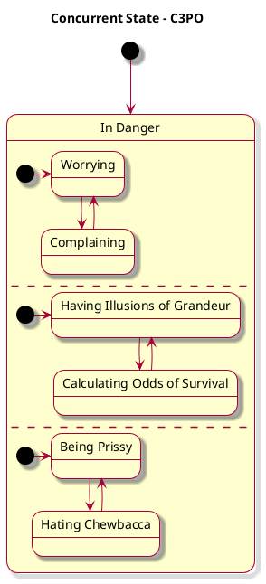
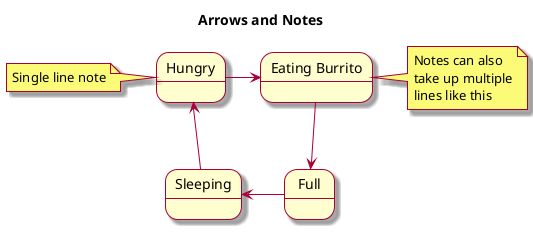

# PlantUML State MD

## Simple state

```plantuml
@startuml

skin rose

title Simple State Model
[*] --> GlassEmpty
GlassEmpty --> [*]
GlassEmpty : Contents - void

GlassEmpty -> GlassFull
GlassFull : Water
GlassFull --> [*]

note right
this is a note
end note

@enduml
```

## Simple composite state

```plantuml
@startuml

skin rose

title Simple Composite State Model
[*] --> NeilDiamond
state NeilDiamond 

state "Neil Diamond" as NeilDiamond {
  state Dancing
  state Singing
  state Smiling
  Dancing --> Singing
  Singing --> Smiling
  Smiling --> Dancing
}

@enduml
```

## Simple orthogonal composite state

```plantuml
@startuml

skin rose

title Simple Orthogonal Composite State Model
[*] --> NeilDiamond
state NeilDiamond 

state "Neil Diamond Onstage" as NeilDiamond {
  state Dancing
  state Singing
  state Smiling
  Dancing --> Singing
  Singing --> Smiling
  Smiling --> Dancing
}

state NDoff
state "Neil Diamond in Dressing Room" as NDoff {
  state ThinkingAboutAmerica
  state WatchingGlee
  ThinkingAboutAmerica --> WatchingGlee
  WatchingGlee --> ThinkingAboutAmerica
}

NeilDiamond -Right-> NDoff : Walking
NDoff -Left-> NeilDiamond :Running

@enduml
```

## Concurrent state 3CPO

```plantuml
@startuml

skin rose

Title Concurrent State - C3PO
[*] --> InDanger
State "In Danger" as InDanger {
  [*] -> Worrying
  Worrying --> Complaining
  Complaining --> Worrying
  --
  state "Having Illusions of Grandeur" as grandeur
  state "Calculating Odds of Survival" as survival
  [*] -> grandeur
  grandeur --> survival
  survival --> grandeur
  --
  state "Being Prissy" as prissy
  state "Hating Chewbacca" as chewbacca
  [*] -> prissy
  prissy --> chewbacca 
  chewbacca --> prissy
} 

@enduml
```

## Arrows and notes

```plantuml
@startuml

skin rose

Title Arrows and Notes
State Hungry
State "Eating Burrito" as EatingBurrito
State Full
State Sleeping

note left of Hungry : Single line note
note right of EatingBurrito
    Notes can also 
    take up multiple
    lines like this
end note

Hungry -right-> EatingBurrito
EatingBurrito -down-> Full
Full -left-> Sleeping
Sleeping -up-> Hungry

@enduml
```
