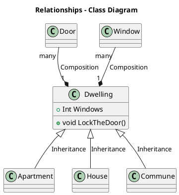
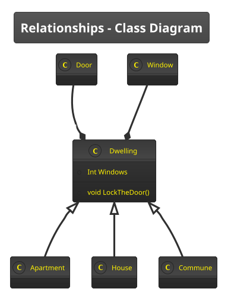
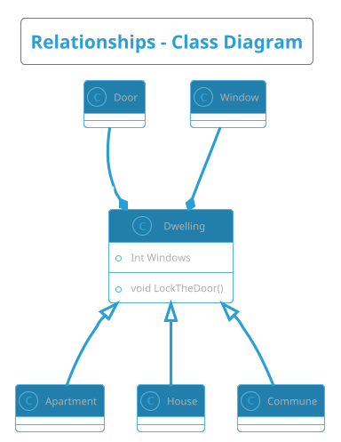

# PlantUML Themes MD

## Theme None

```plantuml
@startuml

!theme _none_

title Relationships - Class Diagram

class Dwelling {
  +Int Windows
  +void LockTheDoor()
}

class Apartment
class House
class Commune
class Window
class Door

Dwelling <|-down- Apartment: Inheritance
Dwelling <|-down- Commune: Inheritance
Dwelling <|-down- House: Inheritance
Dwelling "1" *-up- "many" Window: Composition
Dwelling "1" *-up- "many" Door: Composition

@enduml
```

## Theme Black knight

```plantuml
@startuml

!theme black-knight

title Relationships - Class Diagram

class Dwelling {
  +Int Windows
  +void LockTheDoor()
}

class Apartment
class House
class Commune
class Window
class Door

Dwelling <|-down- Apartment: Inheritance
Dwelling <|-down- Commune: Inheritance
Dwelling <|-down- House: Inheritance
Dwelling "1" *-up- "many" Window: Composition
Dwelling "1" *-up- "many" Door: Composition

@enduml
```

## Theme Cyborg outline

```plantuml
@startuml

!theme cyborg-outline

title Relationships - Class Diagram

class Dwelling {
  +Int Windows
  +void LockTheDoor()
}

class Apartment
class House
class Commune
class Window
class Door

Dwelling <|-down- Apartment: Inheritance
Dwelling <|-down- Commune: Inheritance
Dwelling <|-down- House: Inheritance
Dwelling "1" *-up- "many" Window: Composition
Dwelling "1" *-up- "many" Door: Composition

@enduml
```