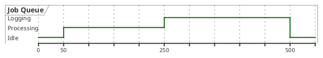
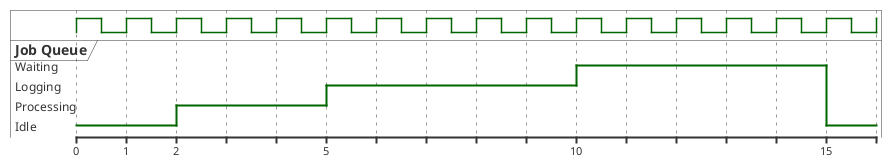
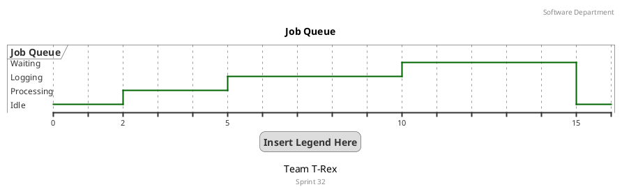
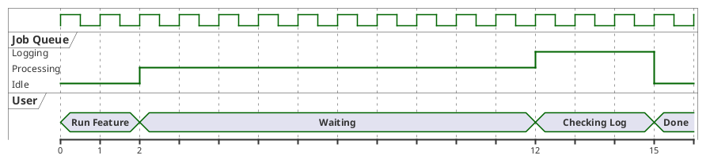
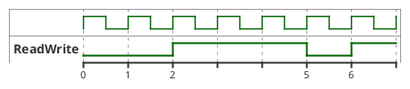
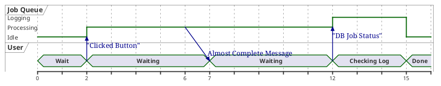
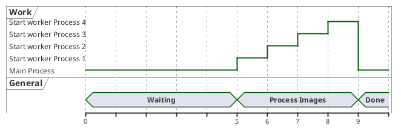
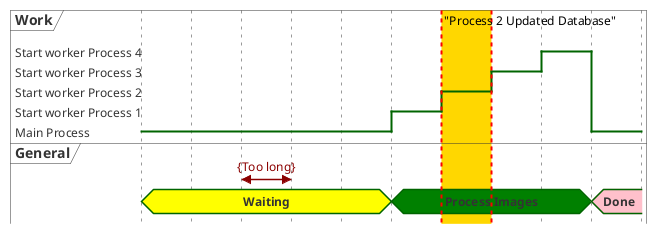
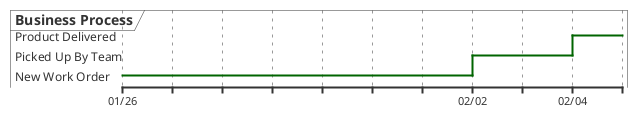
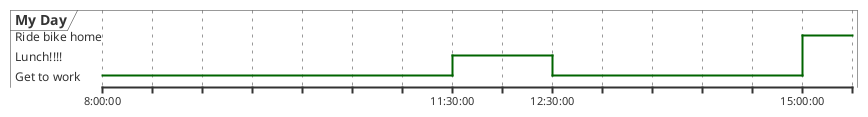

# PlantUML Timing MD

## Robust

```plantuml
@startuml

robust "Job Queue" as JQ

@0
JQ is Idle

@50
JQ is Processing

@250
JQ is Logging

@250
JQ is Waiting

@500
JQ is Idle

@enduml
```

## Clock

```plantuml
@startuml

clock clk with period 1
robust "Job Queue" as JQ

@0
JQ is Idle

@2
JQ is Processing

@5
JQ is Logging

@10
JQ is Waiting

@15
JQ is Idle

@enduml
```

## Extras

```plantuml
@startuml

Title Job Queue
header: Software Department
footer: Sprint 32
legend
Insert Legend Here
end legend
caption Team T-Rex

robust "Job Queue" as JQ

@0
JQ is Idle

@2
JQ is Processing

@5
JQ is Logging

@10
JQ is Waiting

@15
JQ is Idle

@enduml
```

## Concise

```plantuml
@startuml

clock clk with period 1
robust "Job Queue" as JQ
concise "User" as U

@0
JQ is Idle
U is "Run Feature"

@2
JQ is Processing
U is Waiting

@12
JQ is Logging
U is "Checking Log"

@15
JQ is Idle
U is Done

@enduml
```

## Binary

```plantuml
@startuml
clock clk with period 1
binary "ReadWrite" as RW

@0
RW is low

@2
RW is high

@5
RW is low

@6
RW is high

@enduml
```

## Relative timing

```plantuml
@startuml

robust "Job Queue" as JQ
concise "User" as U

@0
JQ is Idle
U is "Wait"

@2
JQ is Processing
U is Waiting
U -> JQ : "Clicked Button"

@6
JQ -> U@+1 : Almost Complete Message

@7
U is "Waiting"

@12
U -> JQ : "DB Job Status"
JQ is Logging
U is "Checking Log"

@15
JQ is Idle
U is Done

@enduml
```

## Participant oriented

```plantuml
@startuml
robust "Work" as W
concise "General" as G

@W
0 is "Main Process"
+5 is "Start worker Process 1"
+1 is "Start worker Process 2"
+1 is "Start worker Process 3"
+1 is "Start worker Process 4"
+1 is "Main Process"

@G
0 is Waiting
+5 is "Process Images"
+4 is "Done"
@enduml
```

## Color, Highlight, Hide, Constraint

```plantuml
@startuml
robust "Work" as W
concise "General" as G

@W
0 is "Main Process"
+5 is "Start worker Process 1"
+1 is "Start worker Process 2"
+1 is "Start worker Process 3"
+1 is "Start worker Process 4"
+1 is "Main Process"

@G
0 is Waiting #yellow
+5 is "Process Images" #green
+4 is "Done" #pink

@2 <-> @+1 : {Too long}

highlight 6 to 7 #Gold;line:Red : "Process 2 Updated Database"

hide time-axis

@enduml
```

## Date

```plantuml
@startuml

robust "Business Process" as BP

@2021/01/26
BP is "New Work Order"

@2021/02/02
BP is "Picked Up By Team"

@2021/02/04
BP is "Product Delivered"

@enduml
```

## Time

```plantuml
@startuml

robust "My Day" as MD

@08:00:00
MD is "Get to work"

@11:30:00
MD is "Lunch!!!!"

@12:30:00
MD is "Get to work"

@15:00:00
MD is "Ride bike home"

@enduml
```