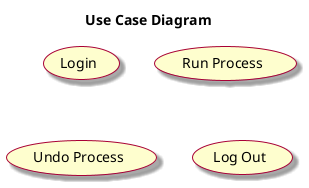
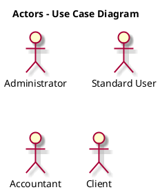
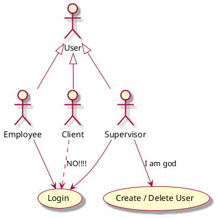
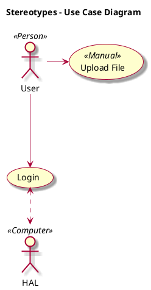
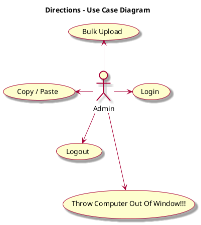
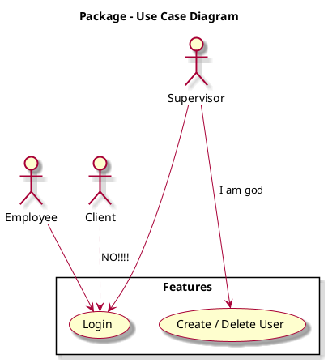

# PlantUML Use Cases MD

## Use cases

```plantuml
@startuml

skin rose

title Use Case Diagram 


(Login)
(Run Process) as (Proc1)
usecase (Undo Process)
usecase (Log Out) as UC4

@enduml
```

## Actors

```plantuml
@startuml

skin rose

title Actors - Use Case Diagram 


:Administrator:
:Standard User: as SU  
actor Accountant
actor :Client: as C

@enduml
```

## Connections

```plantuml
@startuml

skin rose

Employee -up-|> User
Client -up-|> User
Supervisor -up-|> User
Employee --> (Login)
Supervisor --> (Login)
Client ..> (Login) : NO!!!!
Supervisor --> (Create / Delete User): I am god

@enduml
```

## Stereotypes

```plantuml
@startuml

skin rose

title Stereotypes - Use Case Diagram


(Login) as L
(Upload File) as UF<<Manual>>
actor :User: as U<<Person>>
:HAL: as H<<Computer>>

U -> UF
U ---> (L)
H <.up.> (L)

@enduml
```

## Directions

```plantuml
@startuml

skin rose

title Directions - Use Case Diagram

actor :Admin: as A

A -> (Login)
A --> (Logout)
A -left-> (Copy / Paste)
A -up-> (Bulk Upload)
A ---> (Throw Computer Out Of Window!!!)

@enduml
```

## Package

```plantuml
@startuml

skin rose

title Package - Use Case Diagram


rectangle Features {
    (Login)
    (Create / Delete User) as CDU
}

:Employee: 
:Client:
:Supervisor:

Employee --> (Login)
Supervisor --> (Login)
Client ..> (Login) : NO!!!!
Supervisor ---> CDU: I am god

@enduml
```