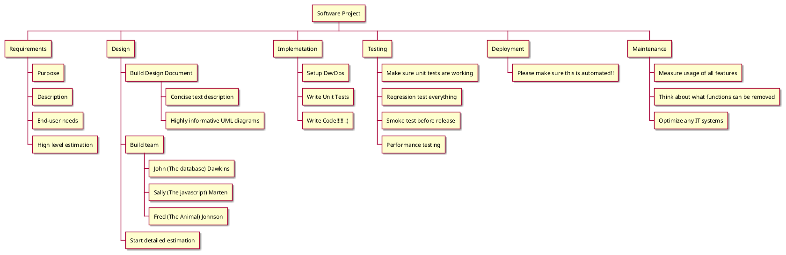
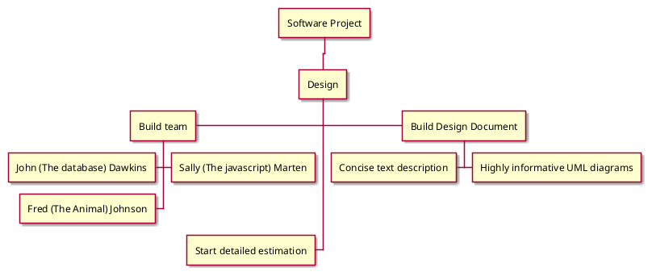
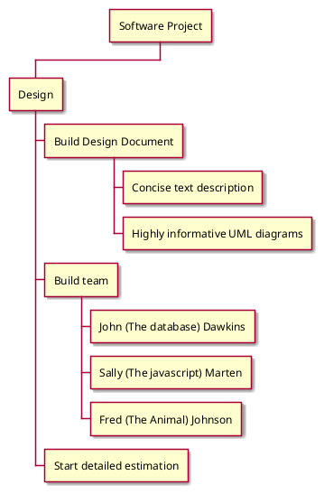
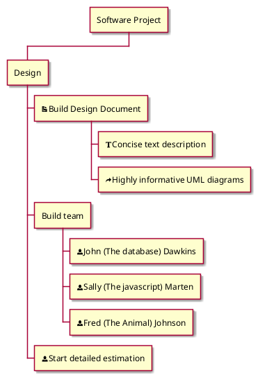
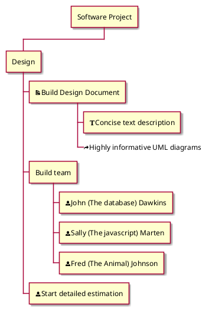
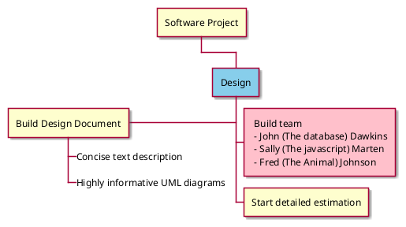
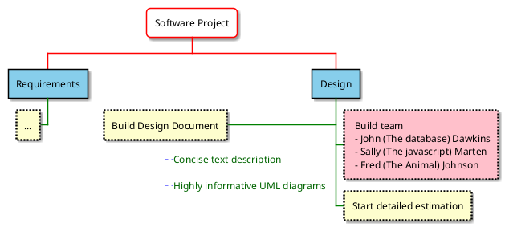

# PlantUML Work Breakdown Structure MD

## OrgMode syntax

```plantuml
@startwbs

skin rose

* Software Project
** Requirements
*** Purpose
*** Description
*** End-user needs
*** High level estimation
** Design
*** Build Design Document
**** Concise text description
**** Highly informative UML diagrams
*** Build team
**** John (The database) Dawkins
**** Sally (The javascript) Marten
**** Fred (The Animal) Johnson
*** Start detailed estimation
** Implemetation
*** Setup DevOps
*** Write Unit Tests
*** Write Code!!!!! :)
** Testing
*** Make sure unit tests are working
*** Regression test everything
*** Smoke test before release
*** Performance testing
** Deployment
*** Please make sure this is automated!!
** Maintenance
*** Measure usage of all features
*** Think about what functions can be removed
*** Optimize any IT systems
@endwbs
```

## Direction

```plantuml
@startwbs

skin rose

* Software Project
** Design
*** Build Design Document
****< Concise text description
**** Highly informative UML diagrams
***< Build team
****< John (The database) Dawkins
****> Sally (The javascript) Marten
****< Fred (The Animal) Johnson
***< Start detailed estimation
@endwbs
```

## Arithmetic Notation

```plantuml
@startwbs

skin rose

+ Software Project
++ Design
+++ Build Design Document
++++ Concise text description
++++ Highly informative UML diagrams
+++ Build team
++++ John (The database) Dawkins
++++ Sally (The javascript) Marten
++++ Fred (The Animal) Johnson
+++ Start detailed estimation
@endwbs
```

## Icons

```plantuml
@startwbs

skin rose

+ Software Project
++ Design
+++ <&document>Build Design Document
++++ <&text>Concise text description
++++ <&share>Highly informative UML diagrams
+++ Build team
++++ <&person>John (The database) Dawkins
++++ <&person>Sally (The javascript) Marten
++++ <&person>Fred (The Animal) Johnson
+++ <&person>Start detailed estimation
@endwbs
```

## Arithmetic Space no boxes

```plantuml
@startwbs

skin rose

+ Software Project
 + Design
  + <&document>Build Design Document
   + <&text>Concise text description
   +_ <&share>Highly informative UML diagrams
  + Build team
   + <&person>John (The database) Dawkins
   + <&person>Sally (The javascript) Marten
   + <&person>Fred (The Animal) Johnson
  + <&person>Start detailed estimation
@endwbs
```

## Multiline & Color

```plantuml
@startwbs

skin rose

<style>
wbsDiagram {
  .pinkname {
      BackgroundColor pink
  }
}
</style>

* Software Project
**[#SkyBlue] Design
***< Build Design Document
****_ Concise text description
****_ Highly informative UML diagrams
***: Build team
 - John (The database) Dawkins
 - Sally (The javascript) Marten
 - Fred (The Animal) Johnson; <<pinkname>>
*** Start detailed estimation
@endwbs
```

## Style & Color

```plantuml
@startwbs

skin rose

<style>
wbsDiagram {
    
    Linecolor black
    .pinkname {
        BackgroundColor pink
    }
    arrow {
        LineColor green
    }
    :depth(0) {
        BackgroundColor White
        RoundCorner 10
        LineColor red
    }
    arrow {
        :depth(2) {
            LineColor blue
            LineStyle 4
            LineThickness .5
        }
    }
    node {
        :depth(2) {
            LineStyle 2
            LineThickness 2.5
        }
    }
    boxless {
        FontColor darkgreen
    }
}
</style>

* Software Project
**[#SkyBlue] Requirements
***< ...
**[#SkyBlue] Design
***< Build Design Document
****_ Concise text description
****_ Highly informative UML diagrams
***: Build team
 - John (The database) Dawkins
 - Sally (The javascript) Marten
 - Fred (The Animal) Johnson; <<pinkname>>
*** Start detailed estimation
@endwbs
```