# Documentation Home

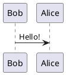

## Flowchart single block

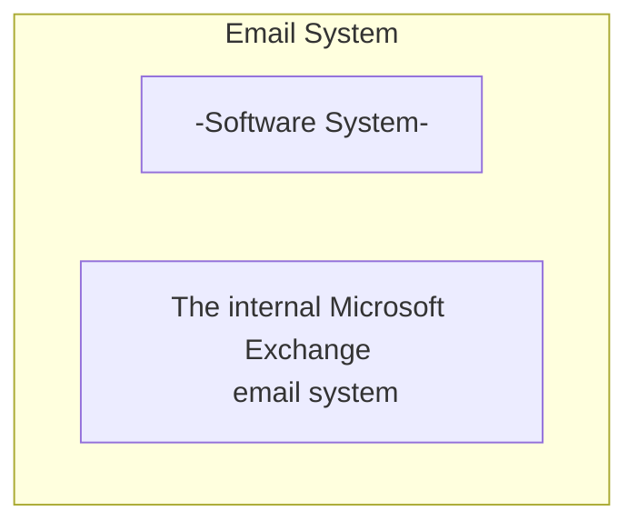


## Flowchart TB

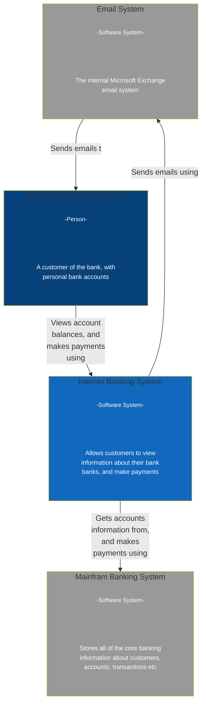

## Flowchart Email System

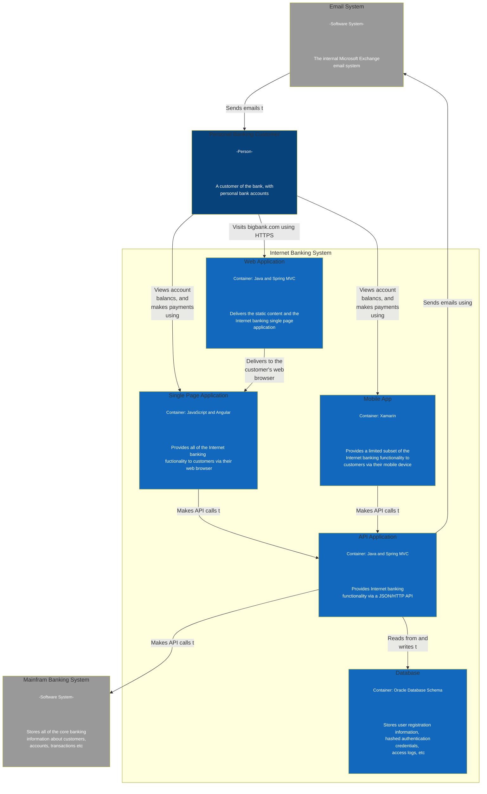

## Flowchart Single Page Application

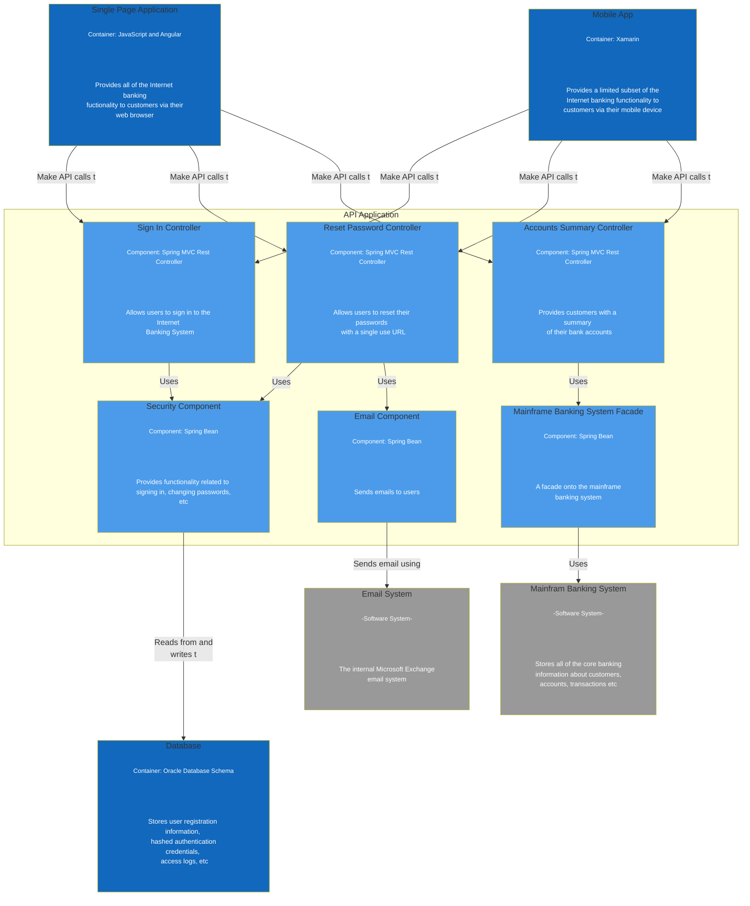

## Basic example

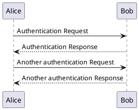

## Declaring participant

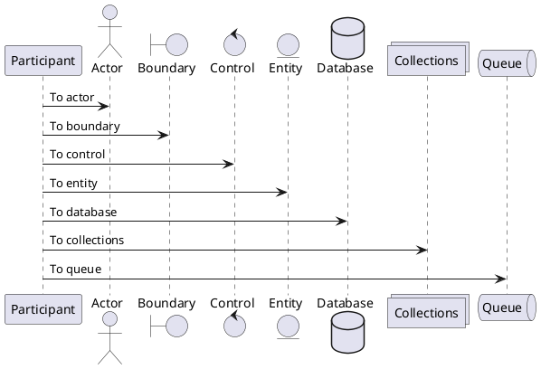

### Rename a participant using the `as` keyword

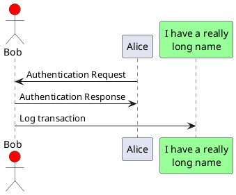

### `order` keyword to customize the display order of participants

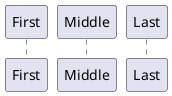

## Declaring participant on multiline

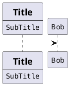

## Use non-letters in participants

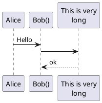

## Message to Self

## Message to Self 1

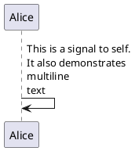

## Message to Self 2

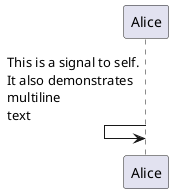

## Text alignment

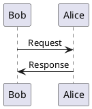

You can put the text of the response message below the arrow, with the skinparam responseMessageBelowArrow true command.

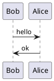

## Change arrow style

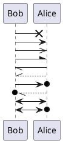

## Change arrow color

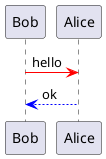

## Message sequence numbering

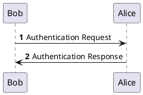

You can specify a startnumber with autonumber `<start>` , and also an increment with autonumber `<start>` `<increment>`.

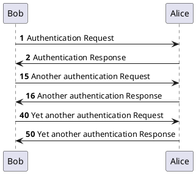

You can specify a format for your number by using between double-quote.
The formatting is done with the Java class DecimalFormat (0 means digit, # means digit and zero if absent).
You can use some html tag in the format.

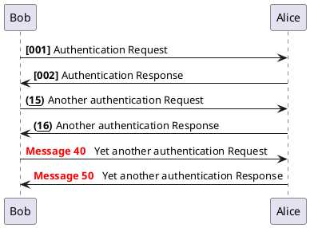

You can also use autonumber stop and autonumber resume `<increment>` `<format>` to respectively pause and resume automatic numbering.

```plantuml
@startuml
autonumber 10 10 "<b>[000]"
Bob -> Alice : Authentication Request
Bob <- Alice : Authentication Response

autonumber stop
Bob -> Alice : dummy

autonumber resume "<font color=red><b>Message 0  "
Bob -> Alice : Yet another authentication Request
Bob <- Alice : Yet another authentication Response

autonumber stop
Bob -> Alice : dummy

autonumber resume 1 "<font color=blue><b>Message 0  "
Bob -> Alice : Yet another authentication Request
Bob <- Alice : Yet another authentication Response
@enduml
```

To increment the first digit, use: autonumber inc A. To increment the second digit, use: autonumber inc B.

```plantuml
@startuml
autonumber 1.1.1
Alice -> Bob: Authentication request
Bob --> Alice: Response

autonumber inc A
'Now we have 2.1.1
Alice -> Bob: Another authentication request
Bob --> Alice: Response

autonumber inc B
'Now we have 2.2.1
Alice -> Bob: Another authentication request
Bob --> Alice: Response

autonumber inc A
'Now we have 3.1.1
Alice -> Bob: Another authentication request
autonumber inc B
'Now we have 3.2.1
Bob --> Alice: Response
@enduml
```

You can also use the value of autonumber with the `autonumber` variable:

```plantuml
@startuml
autonumber 10
Alice -> Bob
note right
  the <U+0025>autonumber<U+0025> works everywhere.
  Here, its value is ** %autonumber% **
end note
Bob --> Alice: //This is the response %autonumber%//
@enduml
```

## Page Title, Header and Footer

The title keyword is used to add a title to the page.
Pages can display headers and footers using header and footer.

```plantuml
@startuml

header Page Header
footer Page %page% of %lastpage%

title Example Title

Alice -> Bob : message 1
Alice -> Bob : message 2

@enduml
```

## Splitting diagrams

```plantuml
@startuml

Alice -> Bob : message 1
Alice -> Bob : message 2

newpage

Alice -> Bob : message 3
Alice -> Bob : message 4

newpage A title for the\nlast page

Alice -> Bob : message 5
Alice -> Bob : message 6
@enduml
```

## Grouping message

```plantuml
@startuml
Alice -> Bob: Authentication Request

alt successful case

    Bob -> Alice: Authentication Accepted

else some kind of failure

    Bob -> Alice: Authentication Failure
    group My own label
    Alice -> Log : Log attack start
        loop 1000 times
            Alice -> Bob: DNS Attack
        end
    Alice -> Log : Log attack end
    end

else Another type of failure

   Bob -> Alice: Please repeat

end
@enduml
```

## Secondary group label

```plantuml
@startuml
Alice -> Bob: Authentication Request
Bob -> Alice: Authentication Failure
group My own label [My own label 2]
    Alice -> Log : Log attack start
    loop 1000 times
        Alice -> Bob: DNS Attack
    end
    Alice -> Log : Log attack end
end
@enduml
```

## Notes on messages

```plantuml
@startuml
Alice->Bob : hello
note left: this is a first note

Bob->Alice : ok
note right: this is another note

Bob->Bob : I am thinking
note left
a note
can also be defined
on several lines
end note
@enduml
```

## Some other notes

```plantuml
@startuml
participant Alice
participant Bob
note left of Alice #aqua
This is displayed
left of Alice.
end note

note right of Alice: This is displayed right of Alice.

note over Alice: This is displayed over Alice.

note over Alice, Bob #FFAAAA: This is displayed\n over Bob and Alice.

note over Bob, Alice
This is yet another
example of
a long note.
end note
@enduml
```

## Changing notes shape [hnote, rnote]

```plantuml
@startuml
caller -> server : conReq
hnote over caller : idle
caller <- server : conConf
rnote over server
 "r" as rectangle
 "h" as hexagon
endrnote
rnote over server
 this is
 on several
 lines
endrnote
hnote over caller
 this is
 on several
 lines
endhnote
@enduml
```

## Note over all participants [across]

```plantuml
@startuml
Alice->Bob:m1
Bob->Charlie:m2
note over Alice, Charlie: Old method for note over all part. with:\n ""note over //FirstPart, LastPart//"".
note across: New method with:\n""note across""
Bob->Alice
hnote across:Note across all part.
@enduml
```

## Several notes aligned at the same level [/]

You can make several notes aligned at the same level, with the syntax /:
without /(by default, the notes are not aligned):

```plantuml
@startuml
note over Alice : initial state of Alice
note over Bob : initial state of Bob
Bob -> Alice : hello
@enduml
```

with /(the notes are aligned):

```plantuml
@startuml
note over Alice : initial state of Alice
/ note over Bob : initial state of Bob
Bob -> Alice : hello
@enduml
```

## Creole and HTML

```plantuml
@startuml
participant Alice
participant "The **Famous** Bob" as Bob

Alice -> Bob : hello --there--
... Some ~~long delay~~ ...
Bob -> Alice : ok
note left
  This is **bold**
  This is //italics//
  This is ""monospaced""
  This is --stroked--
  This is __underlined__
  This is ~~waved~~
end note

Alice -> Bob : A //well formatted// message
note right of Alice
 This is <back:cadetblue><size:18>displayed</size></back>
 __left of__ Alice.
end note
note left of Bob
 <u:red>This</u> is <color #118888>displayed</color>
 **<color purple>left of</color> <s:red>Alice</strike> Bob**.
end note
note over Alice, Bob
 <w:#FF33FF>This is hosted</w> by 
end note
@enduml
```

## Divider or separator

```plantuml
@startuml

== Initialization ==

Alice -> Bob: Authentication Request
Bob --> Alice: Authentication Response

== Repetition ==

Alice -> Bob: Another authentication Request
Alice <-- Bob: another authentication Response

@enduml
```

## Reference

```plantuml
@startuml
participant Alice
actor Bob

ref over Alice, Bob : init

Alice -> Bob : hello

ref over Bob
  This can be on
  several lines
end ref
@enduml
```

## Delay

```plantuml
@startuml

Alice -> Bob: Authentication Request
...
Bob --> Alice: Authentication Response
...5 minutes later...
Bob --> Alice: Good Bye !

@enduml
```

## Text wrapping

```plantuml
@startuml
skinparam maxMessageSize 50
participant a
participant b
a -> b :this\nis\nmanually\ndone
a -> b :this is a very long message on several words
@enduml
```

## Space

```plantuml
@startuml

Alice -> Bob: message 1
Bob --> Alice: ok
|||
Alice -> Bob: message 2
Bob --> Alice: ok
||45||
Alice -> Bob: message 3
Bob --> Alice: ok

@enduml
```

## Lifeline Activation and Destruction

```plantuml
@startuml
participant User

User -> A: DoWork
activate A

A -> B: << createRequest >>
activate B

B -> C: DoWork
activate C
C --> B: WorkDone
destroy C

B --> A: RequestCreated
deactivate B

A -> User: Done
deactivate A

@enduml
```

Nested lifeline can be used, and it is possible to add a color on the lifeline.

```plantuml
@startuml
participant User

User -> A: DoWork
activate A #FFBBBB

A -> A: Internal call
activate A #DarkSalmon

A -> B: << createRequest >>
activate B

B --> A: RequestCreated
deactivate B
deactivate A
A -> User: Done
deactivate A

@enduml
```

Autoactivation is possible and works with the return keywords:

```plantuml
@startuml
autoactivate on
alice -> bob : hello
bob -> bob : self call
bill -> bob #005500 : hello from thread 2
bob -> george ** : create
return done in thread 2
return rc
bob -> george !! : delete
return success

@enduml
```

## Return

```plantuml
@startuml
Bob -> Alice : hello
activate Alice
Alice -> Alice : some action
return bye
@enduml
```

## Participant creation

```plantuml
@startuml
Bob -> Alice : hello

create Other
Alice -> Other : new

create control String
Alice -> String
note right : You can also put notes!

Alice --> Bob : ok

@enduml
```

## Shortcut syntax for activation, deactivation, creation

```plantuml
@startuml
alice -> bob ++ : hello
bob -> bob ++ : self call
bob -> bib ++  #005500 : hello
bob -> george ** : create
return done
return rc
bob -> george !! : delete
return success
@enduml
```

Then you can mix activation and deactivation, on same line:

```plantuml
@startuml
alice   ->  bob     ++   : hello1
bob     ->  charlie --++ : hello2
charlie --> alice   --   : ok
@enduml
```

```plantuml
@startuml
alice -> bob   --++ #gold: hello
bob   -> alice --++ #gold: you too
alice -> bob   --: step1
alice -> bob   : step2
@enduml
```

## Incoming and outgoing messages

```plantuml
@startuml
[-> A: DoWork

activate A

A -> A: Internal call
activate A

A ->] : << createRequest >>

A<--] : RequestCreated
deactivate A
[<- A: Done
deactivate A
@enduml
```

You can also have the following syntax:
```plantuml
@startuml
participant Alice
participant Bob #lightblue
Alice -> Bob
Bob -> Carol
...
[-> Bob
[o-> Bob
[o->o Bob
[x-> Bob
...
[<- Bob
[x<- Bob
...
Bob ->]
Bob ->o]
Bob o->o]
Bob ->x]
...
Bob <-]
Bob x<-]

@enduml
```
## Short arrows for incoming and outgoing messages

```plantuml
@startuml
?-> Alice    : ""?->""\n**short** to actor1
[-> Alice    : ""[->""\n**from start** to actor1
[-> Bob      : ""[->""\n**from start** to actor2
?-> Bob      : ""?->""\n**short** to actor2
Alice ->]    : ""->]""\nfrom actor1 **to end**
Alice ->?    : ""->?""\n**short** from actor1
Alice -> Bob : ""->"" \nfrom actor1 to actor2
@enduml
```

## Anchors and Duration

```plantuml
@startuml
!pragma teoz true

{start} Alice -> Bob : start doing things during duration
Bob -> Max : something
Max -> Bob : something else
{end} Bob -> Alice : finish

{start} <-> {end} : some time

@enduml
```

## Stereotypes and Spots

```plantuml
@startuml

participant "Famous Bob" as Bob << Generated >>
participant Alice << (C,#ADD1B2) Testable >>

Bob->Alice: First message

@enduml
```

By default, the guillemet character is used to display the stereotype. You can change this behavious using the skinparam guillemet:

```plantuml
@startuml

skinparam guillemet false
participant "Famous Bob" as Bob << Generated >>
participant Alice << (C,#ADD1B2) Testable >>

Bob->Alice: First message

@enduml
```

```plantuml
@startuml

participant Bob << (C,#ADD1B2) >>
participant Alice << (C,#ADD1B2) >>

Bob->Alice: First message

@enduml
```

## More information on titles

```plantuml
@startuml

title __Simple__ **communication** example

Alice -> Bob: Authentication Request
Bob -> Alice: Authentication Response

@enduml
```

You can add newline using \n in the title description.
```plantuml
@startuml

title __Simple__ communication example\non several lines

Alice -> Bob: Authentication Request
Bob -> Alice: Authentication Response

@enduml
```

You can also define title on several lines using title and end title keywords.
```plantuml
@startuml

title
 <u>Simple</u> communication example
 on <i>several</i> lines and using <font color=red>html</font>
 This is hosted by 
end title

Alice -> Bob: Authentication Request
Bob -> Alice: Authentication Response

@enduml
```

## Participants encompass

You can add an optional title or a optional background color, after the box keyword.
```plantuml
@startuml

box "Internal Service" #LightBlue
participant Bob
participant Alice
end box
participant Other

Bob -> Alice : hello
Alice -> Other : hello

@enduml
```

It is also possible to nest boxes - to draw a box within a box - when using the teoz rendering engine, for example:
```plantuml
@startuml

!pragma teoz true
box "Internal Service" #LightBlue
participant Bob
box "Subteam"
participant Alice
participant John
end box

end box
participant Other

Bob -> Alice : hello
Alice -> John : hello
John -> Other: Hello

@enduml
```

## Removing Foot Boxes

```plantuml
@startuml

hide footbox
title Foot Box removed

Alice -> Bob: Authentication Request
Bob --> Alice: Authentication Response

@enduml
```

## Skinparam

```plantuml
@startuml
skinparam sequenceArrowThickness 2
skinparam roundcorner 20
skinparam maxmessagesize 60
skinparam sequenceParticipant underline

actor User
participant "First Class" as A
participant "Second Class" as B
participant "Last Class" as C

User -> A: DoWork
activate A

A -> B: Create Request
activate B

B -> C: DoWork
activate C
C --> B: WorkDone
destroy C

B --> A: Request Created
deactivate B

A --> User: Done
deactivate A

@enduml
```

```plantuml
@startuml
skinparam backgroundColor #EEEBDC
skinparam handwritten true

skinparam sequence {
ArrowColor DeepSkyBlue
ActorBorderColor DeepSkyBlue
LifeLineBorderColor blue
LifeLineBackgroundColor #A9DCDF

ParticipantBorderColor DeepSkyBlue
ParticipantBackgroundColor DodgerBlue
ParticipantFontName Impact
ParticipantFontSize 17
ParticipantFontColor #A9DCDF

ActorBackgroundColor aqua
ActorFontColor DeepSkyBlue
ActorFontSize 17
ActorFontName Aapex
}

actor User
participant "First Class" as A
participant "Second Class" as B
participant "Last Class" as C

User -> A: DoWork
activate A

A -> B: Create Request
activate B

B -> C: DoWork
activate C
C --> B: WorkDone
destroy C

B --> A: Request Created
deactivate B

A --> User: Done
deactivate A

@enduml
```

## Changing padding

```plantuml
@startuml
skinparam ParticipantPadding 20
skinparam BoxPadding 10

box "Foo1"
participant Alice1
participant Alice2
end box
box "Foo2"
participant Bob1
participant Bob2
end box
Alice1 -> Bob1 : hello
Alice1 -> Out : out
@enduml
```

## Appendix

### Examples of all arrow type

```plantuml
@startuml
participant Alice as a
participant Bob   as b
a ->     b : ""->   ""
a ->>    b : ""->>  ""
a -\     b : ""-\   ""
a -\\    b : ""-\\\\""
a -/     b : ""-/   ""
a -//    b : ""-//  ""
a ->x    b : ""->x  ""
a x->    b : ""x->  ""
a o->    b : ""o->  ""
a ->o    b : ""->o  ""
a o->o   b : ""o->o ""
a <->    b : ""<->  ""
a o<->o  b : ""o<->o""
a x<->x  b : ""x<->x""
a ->>o   b : ""->>o ""
a -\o    b : ""-\o  ""
a -\\o   b : ""-\\\\o""
a -/o    b : ""-/o  ""
a -//o   b : ""-//o ""
a x->o   b : ""x->o ""
@enduml
```

### Itself arrow

```plantuml
@startuml
participant Alice as a
participant Bob   as b
a ->     a : ""->   ""
a ->>    a : ""->>  ""
a -\     a : ""-\   ""
a -\\    a : ""-\\\\""
a -/     a : ""-/   ""
a -//    a : ""-//  ""
a ->x    a : ""->x  ""
a x->    a : ""x->  ""
a o->    a : ""o->  ""
a ->o    a : ""->o  ""
a o->o   a : ""o->o ""
a <->    a : ""<->  ""
a o<->o  a : ""o<->o""
a x<->x  a : ""x<->x""
a ->>o   a : ""->>o ""
a -\o    a : ""-\o  ""
a -\\o   a : ""-\\\\o""
a -/o    a : ""-/o  ""
a -//o   a : ""-//o ""
a x->o   a : ""x->o ""
@enduml
```

### Incoming messages (with '[')

```plantuml
@startuml
participant Alice as a
participant Bob   as b
[->      b : ""[->   ""
[->>     b : ""[->>  ""
[-\      b : ""[-\   ""
[-\\     b : ""[-\\\\""
[-/      b : ""[-/   ""
[-//     b : ""[-//  ""
[->x     b : ""[->x  ""
[x->     b : ""[x->  ""
[o->     b : ""[o->  ""
[->o     b : ""[->o  ""
[o->o    b : ""[o->o ""
[<->     b : ""[<->  ""
[o<->o   b : ""[o<->o""
[x<->x   b : ""[x<->x""
[->>o    b : ""[->>o ""
[-\o     b : ""[-\o  ""
[-\\o    b : ""[-\\\\o""
[-/o     b : ""[-/o  ""
[-//o    b : ""[-//o ""
[x->o    b : ""[x->o ""
@enduml
```

### Outgoing messages (with ']')

```plantuml
@startuml
participant Alice as a
participant Bob   as b
a ->]      : ""->]   ""
a ->>]     : ""->>]  ""
a -\]      : ""-\]   ""
a -\\]     : ""-\\\\]""
a -/]      : ""-/]   ""
a -//]     : ""-//]  ""
a ->x]     : ""->x]  ""
a x->]     : ""x->]  ""
a o->]     : ""o->]  ""
a ->o]     : ""->o]  ""
a o->o]    : ""o->o] ""
a <->]     : ""<->]  ""
a o<->o]   : ""o<->o]""
a x<->x]   : ""x<->x]""
a ->>o]    : ""->>o] ""
a -\o]     : ""-\o]  ""
a -\\o]    : ""-\\\\o]""
a -/o]     : ""-/o]  ""
a -//o]    : ""-//o] ""
a x->o]    : ""x->o] ""
@enduml
```

### Short incoming (with '?')

```plantuml
@startuml
participant Alice as a
participant Bob   as b
a ->     b : //Long long label//
?->      b : ""?->   ""
?->>     b : ""?->>  ""
?-\      b : ""?-\   ""
?-\\     b : ""?-\\\\""
?-/      b : ""?-/   ""
?-//     b : ""?-//  ""
?->x     b : ""?->x  ""
?x->     b : ""?x->  ""
?o->     b : ""?o->  ""
?->o     b : ""?->o  ""
?o->o    b : ""?o->o ""
?<->     b : ""?<->  ""
?o<->o   b : ""?o<->o""
?x<->x   b : ""?x<->x""
?->>o    b : ""?->>o ""
?-\o     b : ""?-\o  ""
?-\\o    b : ""?-\\\\o ""
?-/o     b : ""?-/o  ""
?-//o    b : ""?-//o ""
?x->o    b : ""?x->o ""
@enduml
```

### Short outgoing (with '?')

```plantuml
@startuml
participant Alice as a
participant Bob   as b
a ->     b : //Long long label//
a ->?      : ""->?   ""
a ->>?     : ""->>?  ""
a -\?      : ""-\?   ""
a -\\?     : ""-\\\\?""
a -/?      : ""-/?   ""
a -//?     : ""-//?  ""
a ->x?     : ""->x?  ""
a x->?     : ""x->?  ""
a o->?     : ""o->?  ""
a ->o?     : ""->o?  ""
a o->o?    : ""o->o? ""
a <->?     : ""<->?  ""
a o<->o?   : ""o<->o?""
a x<->x?   : ""x<->x?""
a ->>o?    : ""->>o? ""
a -\o?     : ""-\o?  ""
a -\\o?    : ""-\\\\o?""
a -/o?     : ""-/o?  ""
a -//o?    : ""-//o? ""
a x->o?    : ""x->o? ""
@enduml
```

## Specific SkinParameter

### By default

```plantuml
@startuml
Bob -> Alice : hello
Alice -> Bob : ok
@enduml
```

### LifelineStrategy

#### Nosolid (by default)

```plantuml
@startuml
skinparam lifelineStrategy nosolid
Bob -> Alice : hello
Alice -> Bob : ok
@enduml
```

#### Solid

```plantuml
@startuml
skinparam lifelineStrategy solid
Bob -> Alice : hello
Alice -> Bob : ok
@enduml
```

### Style strictuml

```plantuml
@startuml
skinparam style strictuml
Bob -> Alice : hello
Alice -> Bob : ok
@enduml
```

## Hide unlinked participant

By default, all participants are displayed.

```plantuml
@startuml
participant Alice
participant Bob
participant Carol

Alice -> Bob : hello
@enduml
```

But you can hide unlinked participant.

```plantuml
@startuml
hide unlinked
participant Alice
participant Bob
participant Carol

Alice -> Bob : hello
@enduml
```


## Color a group message

```plantuml
@startuml
Alice -> Bob: Authentication Request
alt#Gold #LightBlue Successful case
    Bob -> Alice: Authentication Accepted
else #Pink Failure
    Bob -> Alice: Authentication Rejected
end
@enduml
```

## Mainframe

```plantuml
@startuml
mainframe This is a **mainframe**
Alice->Bob : Hello
@enduml
```

## Slanted or odd arrows

```plantuml
@startuml
A ->(10) B: text 10
B ->(10) A: text 10

A ->(10) B: text 10
A (10)<- B: text 10
@enduml
```

```plantuml
@startuml
A ->(40) B++: Rq
B -->(20) A--: Rs
@enduml
```

```plantuml
@startuml
!pragma teoz true
A ->(50) C: Starts\nwhen 'B' sends
& B ->(25) C: \nBut B's message\n arrives before A's
@enduml
```

```plantuml
@startuml
!pragma teoz true

S1 ->(30) S2: msg 1\n
& S2 ->(30) S1: msg 2

note left S1: msg\nS2 to S1
& note right S2: msg\nS1 to S2
@enduml
```

## Participants

```plantuml
@startuml

skin rose

title "Participants - Sequence Diagram"

actor User
boundary "Web GUI" as GUI
control "Shopping Cart" as SC
entity Widget
database Widgets

@enduml
```

## Messages

```plantuml
@startuml

skin rose

title "Messages - Sequence Diagram"

actor User
boundary "Web GUI" as GUI
control "Shopping Cart" as SC
entity Widget
database Widgets

User -> GUI : To boundary
GUI -> SC : To control
SC -> Widget : To entity
Widget -> Widgets : To database

@enduml
```

## Comments


```plantuml
@startuml

skin rose

title "Comments - Sequence Diagram"

'This is a single line comment

/'
This is a multi-
line comment
'/

actor User
boundary "Web GUI" as GUI
control "Shopping Cart" as SC
entity Widget
database Widgets

User -> GUI : To boundary
GUI -> SC : To control
SC -> Widget : To entity
Widget -> Widgets : To database

@enduml
```
