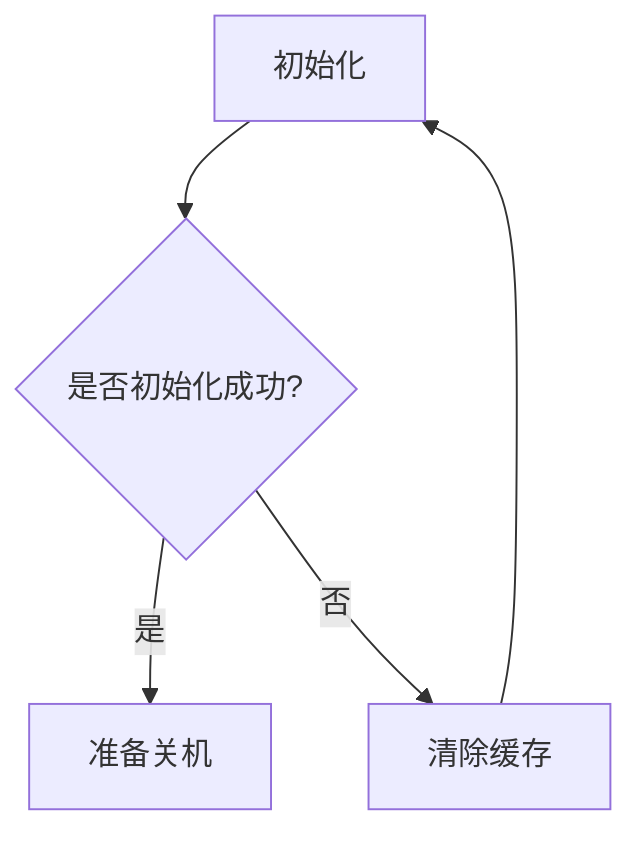
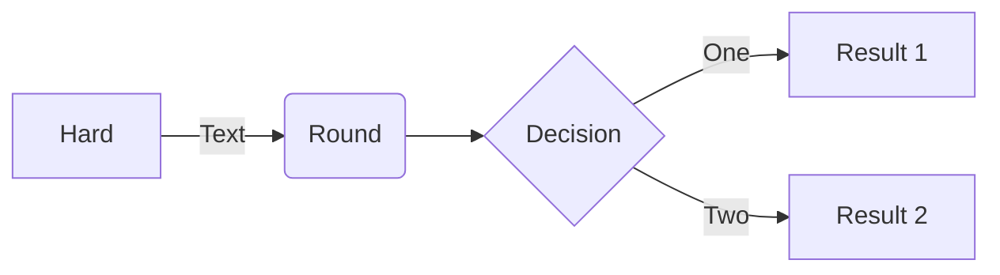

# Mermaid, PlantUML, D2





```tex
\alpha \beta \gamma \rho \sigma \delta \epsilon
```

```D2
vars: {
  d2-config: {
    layout-engine: elk
    # Terminal theme code
    theme-id: 300
  }
}
network: {
  cell tower: {
    satellites: {
      shape: stored_data
      style.multiple: true
    }

    transmitter

    satellites -> transmitter: send
    satellites -> transmitter: send
    satellites -> transmitter: send
  }

  online portal: {
    ui: {shape: hexagon}
  }

  data processor: {
    storage: {
      shape: cylinder
      style.multiple: true
    }
  }

  cell tower.transmitter -> data processor.storage: phone logs
}

user: {
  shape: person
  width: 130
}

user -> network.cell tower: make call
user -> network.online portal.ui: access {
  style.stroke-dash: 3
}

api server -> network.online portal.ui: display
api server -> logs: persist
logs: {shape: page; style.multiple: true}

network.data processor -> api server

```