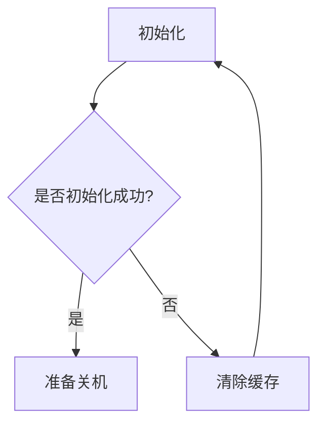
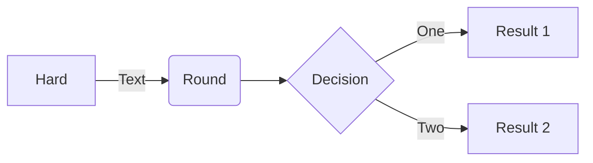

# Mermaid, PlantUML, D2

test 


Test


<video src="goLand.mp4" preview-src="book.jpg"/>


```java
class Hello {
    public static void main(String[] args) {
        System.out.println("Hello");
    }
}
```

```python
# Python program to check if year is a leap year or not

year = 2000

# To get year (integer input) from the user
# year = int(input("Enter a year: "))

# divided by 100 means century year (ending with 00)
# century year divided by 400 is leap year
if (year % 400 == 0) and (year % 100 == 0):
    print("{0} is a leap year".format(year))

# not divided by 100 means not a century year
# year divided by 4 is a leap year
elif (year % 4 ==0) and (year % 100 != 0):
    print("{0} is a leap year".format(year))

# if not divided by both 400 (century year) and 4 (not century year)
# year is not leap year
else:
    print("{0} is not a leap year".format(year))
```

[link](https://jetbrains.com "com.jetbrains.cidr.cocoapods.CocoaPodsUtils next word more words even more words")

Test <res resource-id="xls" filter="" id="w"/> 21

Paragraph 1 with some text and some [%product%].

<var name="product" value="original value"/>

Paragraph 2 with some text and some [%product%].

<-- Some other Markdown contents -->

<var name="product" value="new value"/>

Paragraph 3 with some text and some [%product%].

```
fn main() {
    println!("Hello, world!");
}
```

```C#
/// We're using this table as a singleton,
/// so there should typically only be one element where the version is 0.
[SomeAttribute("Test")]
public partial class Config
{
   public SomeClassType SomeClass;
   public string? SomeString;
}
```



Test



Test

```tex
\alpha \beta \gamma \rho \sigma \delta \epsilon
```

```D2
vars: {
  d2-config: {
    layout-engine: elk
    # Terminal theme code
    theme-id: 300
  }
}
network: {
  cell tower: {
    satellites: {
      shape: stored_data
      style.multiple: true
    }

    transmitter

    satellites -> transmitter: send
    satellites -> transmitter: send
    satellites -> transmitter: send
  }

  online portal: {
    ui: {shape: hexagon}
  }

  data processor: {
    storage: {
      shape: cylinder
      style.multiple: true
    }
  }

  cell tower.transmitter -> data processor.storage: phone logs
}

user: {
  shape: person
  width: 130
}

user -> network.cell tower: make call
user -> network.online portal.ui: access {
  style.stroke-dash: 3
}

api server -> network.online portal.ui: display
api server -> logs: persist
logs: {shape: page; style.multiple: true}

network.data processor -> api server

```